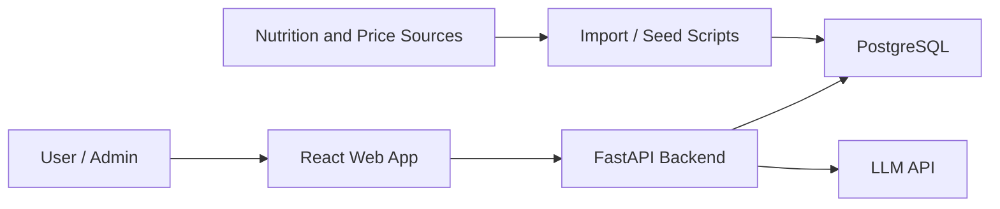
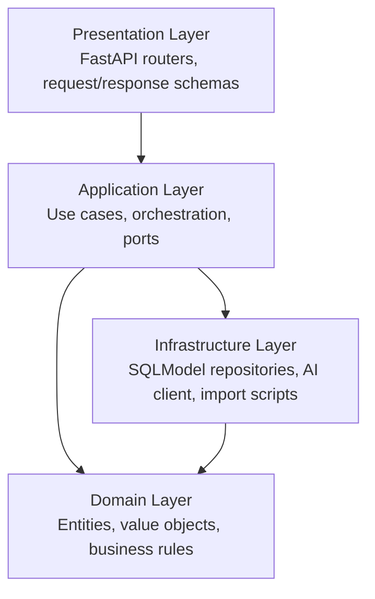
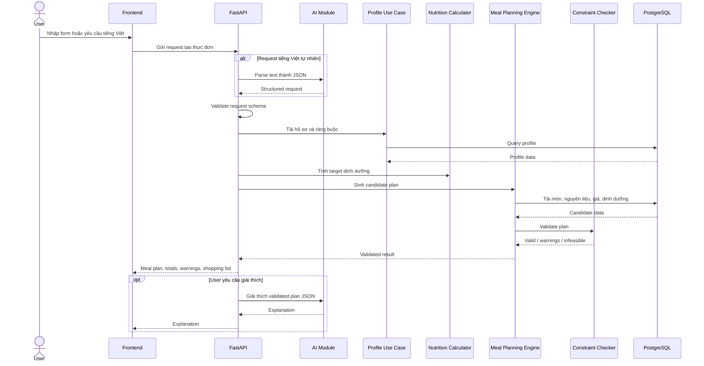
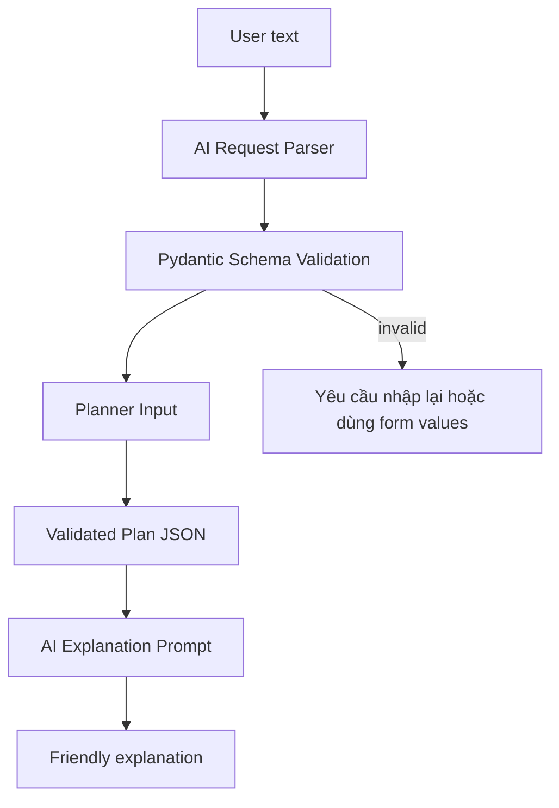
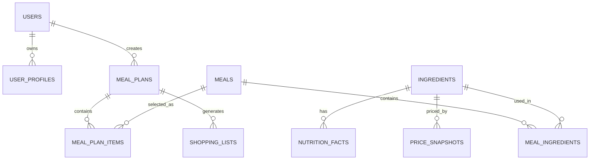
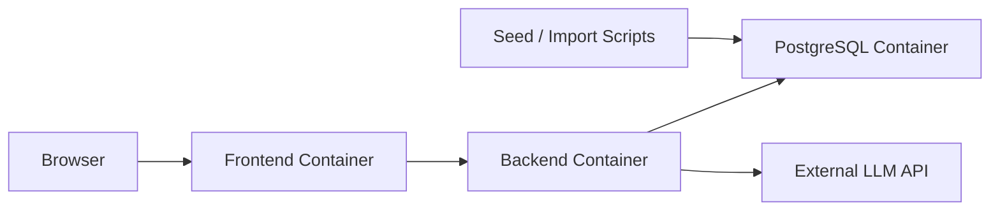

# Smart Menu - Tài liệu kiến trúc hệ thống

## 1. Mục tiêu kiến trúc

Smart Menu được thiết kế như một hệ thống lập thực đơn có thể kiểm chứng. Mục tiêu quan trọng nhất là tách rõ phần AI hỗ trợ ngôn ngữ khỏi phần tính toán deterministic.

Nguyên tắc chính:

- AI hỗ trợ parse tiếng Việt, giải thích kết quả đã validate và gợi ý thay thế.
- AI không tính chi phí, dinh dưỡng hoặc quyết định tính hợp lệ cuối cùng.
- Chi phí và dinh dưỡng được tính từ dữ liệu có cấu trúc.
- Mọi thực đơn trước khi trả về user phải qua Constraint Checker.

## 2. Công nghệ sử dụng

| Lớp | Công nghệ | Ghi chú |
| --- | --- | --- |
| Frontend | React, TypeScript, Tailwind CSS | Giao diện cho User và Admin |
| Backend | Python FastAPI | REST API, use case, calculation, planning, AI orchestration |
| Database | PostgreSQL | Lưu user, nguyên liệu, món ăn, giá, dinh dưỡng và lịch sử |
| ORM | SQLModel hoặc SQLAlchemy | Triển khai repository và model có kiểu rõ |
| Migration | Alembic | Quản lý thay đổi schema |
| Validation | Pydantic, Zod | Validate backend và frontend |
| AI Integration | DeepSeek API hoặc LLM API tương thích | Chỉ dùng cho ngôn ngữ và giải thích |
| Vector Search (tùy chọn) | pgvector hoặc Qdrant | Chỉ dùng nếu cần RAG tri thức dinh dưỡng, không bắt buộc cho MVP |
| Deployment | Docker Compose | Demo local với frontend, backend và database |

## 3. Kiểu kiến trúc

Backend sử dụng Modular Monolith kết hợp Clean Architecture.

Ý nghĩa:

- MVP triển khai một backend service duy nhất.
- Các miền nghiệp vụ được chia thành module độc lập.
- Mỗi module có use case, schema, repository interface và domain logic riêng.
- Framework và database nằm ngoài domain layer.
- Có thể tách module thành service riêng nếu cần, nhưng không phải mục tiêu hiện tại.

## 4. System context

## 5. Phân lớp backend

Quy tắc phụ thuộc:

- Domain không import FastAPI, SQLModel, database session, AI client hoặc frontend type.
- Application điều phối workflow và phụ thuộc vào repository port.
- Infrastructure triển khai repository port và external client.
- Presentation validate input ở mức transport và gọi use case.

## 6. Module map

| Module | Trách nhiệm | Artifact chính |
| --- | --- | --- |
| `identity` | Đăng ký, đăng nhập, đăng xuất, phân quyền | users, password hashing, auth token |
| `profiles` | Hồ sơ dinh dưỡng, mục tiêu, dị ứng, thực phẩm loại trừ | user_profiles, nutrition target input |
| `ingredients` | Nguyên liệu, giá, dinh dưỡng | ingredients, nutrition_facts, price_snapshots |
| `meals` | Món ăn, công thức, định lượng nguyên liệu | meals, meal_ingredients |
| `nutrition` | Tính BMR/TDEE và macro target | calculator, nutrition target DTO |
| `meal_planning` | Dish candidate, precheck, CP-SAT composition, checker, snapshot V2 | dish_candidate_repository, feasibility, optimizer, planner, constraint_checker |
| `shopping_lists` | Gộp ingredient snapshot V2; best-effort recipe hiện tại cho V1 | shopping list generator |
| `ai` | Prompt, parse JSON, giải thích, ngôn ngữ thay thế | prompts, AI client, schema validation |
| `admin` | Tác vụ quản trị và kiểm tra dữ liệu | data quality checks |

## 7. Luồng tạo thực đơn

## 8. Planning pipeline

1. Chuẩn hóa request của user.
2. Validate các trường request.
3. Tải hồ sơ, dị ứng, thực phẩm loại trừ và sở thích.
4. Tính target dinh dưỡng/ngày.
5. Tải `v_dish_candidates` planner-ready theo batch.
6. Tiền kiểm role bắt buộc, budget tối thiểu và macro attainable range.
7. CP-SAT ghép dish cho toàn bộ ngày: breakfast 1 dish; lunch/dinner 3 dish theo role.
8. Tối ưu nutrition toàn ngày trước, sau đó đa dạng/preference/cost.
9. Recompute totals từ dish snapshot và chạy Constraint Checker độc lập.
10. Lưu schema_version=2 và dùng snapshot để lập shopping list.
11. Sinh shopping list.
12. Trả kết quả hợp lệ hoặc infeasible report.

## 9. Ranh giới tính toán deterministic

Các phần sau bắt buộc phải chính xác:

- Tính chi phí món ăn.
- Tính tổng chi phí ngày và tuần.
- Gộp định lượng nguyên liệu.
- Tính calo, protein, fat và carb.
- Validate ngân sách.
- Validate dị ứng và thực phẩm loại trừ.
- Validate loại bữa và số bữa.
- Xác định trạng thái cuối: valid, valid_with_warnings hoặc infeasible.

AI chỉ được biến đổi hoặc giải thích dữ liệu đã được các module deterministic tạo ra.

## 10. Kiến trúc AI

Guardrails:

- Prompt phải ghi rõ AI không được tính toán hoặc override số liệu hệ thống.
- Parser output phải khớp JSON schema nghiêm ngặt.
- Output sai schema dẫn tới retry, yêu cầu user nhập lại hoặc fallback về form.
- Prompt giải thích chỉ nhận validated plan JSON.
- AI không được thêm món, nguyên liệu, giá hoặc macro không có trong JSON đã validate.
- Mọi món thay thế do AI gợi ý phải chạy lại Planner và Constraint Checker.

## 11. Kiến trúc dữ liệu

Nguyên tắc dữ liệu:

- `ingredients`, `nutrition_facts`, `price_snapshots` và `meal_ingredients` là nguồn đúng cho tính toán.
- Nếu lưu cache giá/macro ở `meals`, các giá trị đó phải có thể tính lại từ dữ liệu gốc.
- Lịch sử thực đơn lưu snapshot để kết quả cũ ổn định.
- Script import/seed cần ghi nguồn dữ liệu và thời điểm thu thập.

## 12. Kiến trúc API

| Nhóm API | Mục đích |
| --- | --- |
| `/api/auth/*` | Xác thực và thông tin tài khoản hiện tại |
| `/api/users/*` | Quản lý user |
| `/api/profiles/*` | CRUD hồ sơ và preview target dinh dưỡng |
| `/api/ingredients/*` | CRUD nguyên liệu, dinh dưỡng, giá |
| `/api/meals/*` | CRUD món ăn và công thức |
| `/api/meal-plans/*` | Tạo, validate, lưu, xem và dùng lại thực đơn |
| `/api/shopping-lists/*` | Sinh và xem shopping list |
| `/api/ai/*` | Parse request, giải thích, gợi ý thay thế, diễn giải cảnh báo |
| `/api/admin/*` | Audit và maintenance cho Admin |

Quy ước response:

- Trả JSON có type rõ.
- Error có mã ổn định để frontend xử lý.
- Warning tách riêng khỏi blocking error.
- Không bao giờ trả `valid` nếu Constraint Checker chưa chạy thành công.

## 13. Domain objects chính

| Object | Mô tả |
| --- | --- |
| `NutritionTarget` | Mục tiêu calo và macro/ngày tính từ hồ sơ |
| `MealCandidate` | Món đang active kèm cost, macro, tag và nguyên liệu |
| `PlanRequest` | Request đã chuẩn hóa từ form hoặc AI parser |
| `MealPlan` | Món đã chọn theo ngày và slot bữa |
| `ValidationResult` | Trạng thái hard constraints, soft warnings và infeasible reasons |
| `ShoppingList` | Nguyên liệu đã gộp và tổng chi phí dự kiến |

## 14. Chiến lược lỗi và cảnh báo

Lỗi dừng xử lý:

- Chưa đăng nhập.
- Không đủ quyền.
- Request sai schema.
- Thiếu hồ sơ bắt buộc.
- Lỗi database hoặc external service.

Cảnh báo vẫn cho hiển thị:

- Calo lệch khỏi target.
- Macro chưa cân đối.
- Món lặp gần ngưỡng.
- Giá tham khảo đã cũ.
- AI không khả dụng, hệ thống fallback về form hoặc dữ liệu kỹ thuật.

Planning bất khả thi không phải lỗi hệ thống. Đây là kết quả nghiệp vụ và phải giải thích user nên tăng ngân sách, giảm số bữa, giảm số ngày hoặc nới lỏng thực phẩm loại trừ.

## 15. Bảo mật

- Hash mật khẩu trước khi lưu.
- Dùng token hoặc session cho API cần đăng nhập.
- Kiểm tra quyền sở hữu dữ liệu với profile, meal plan và shopping list.
- Kiểm tra role Admin cho API quản trị.
- Validate mọi input bằng Pydantic.
- Secret key và API key nằm trong biến môi trường, không commit.
- Tối thiểu hóa dữ liệu cá nhân gửi tới AI provider.
- CORS cấu hình rõ origin frontend.

## 16. Kiểm thử

Unit tests:

- Tính target dinh dưỡng.
- Tính cost món ăn.
- Tính macro món ăn.
- Gộp shopping list.
- Kiểm tra hard constraints.
- Chấm điểm soft constraints.

Integration tests:

- Luồng auth.
- Luồng profile đến meal planning.
- Planner với sample database.
- Validate output AI parser.
- Lưu và xem lịch sử thực đơn.

Acceptance tests:

- Tạo được thực đơn 7 ngày khả thi trong ngân sách.
- Ngân sách quá thấp trả infeasible report.
- Dị ứng không xuất hiện trong plan hợp lệ.
- AI lỗi vẫn tạo được plan bằng form.
- AI explanation không mâu thuẫn với validated data.

## 17. Deployment view

MVP Docker Compose nên khởi chạy:

- Frontend web app.
- Backend API.
- PostgreSQL database.
- Lệnh seed/import dữ liệu mẫu.

## 18. Architecture decisions

| Quyết định | Lý do |
| --- | --- |
| Modular Monolith thay vì microservices | Dễ demo, ít overhead triển khai |
| Tách AI khỏi calculation boundary | Tránh hallucination về giá và dinh dưỡng |
| Dùng PostgreSQL | Phù hợp dữ liệu quan hệ: công thức, giá, nutrition, lịch sử |
| Dùng price snapshot | Không phụ thuộc scraping realtime |
| RAG/vector search là optional | MVP cần dữ liệu có cấu trúc hơn vector search |
| Lưu snapshot trong meal plan | Kết quả cũ ổn định sau khi cập nhật dữ liệu gốc |

