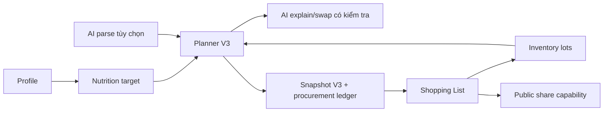

# Smart Menu — Handbook kỹ thuật

Tài liệu này dành cho developer bảo trì Smart Menu, người thuyết trình phần kỹ thuật và người chưa vững code nhưng muốn hiểu trọn luồng. Nguồn sự thật là working tree hiện tại, được đối chiếu ngày **20/07/2026**. Không tài liệu nào ở đây thay thế code, OpenAPI runtime hoặc migration SQL.

## Lộ trình đọc

1. [Kiến trúc hệ thống](architecture.md) để hiểu ranh giới thành phần và quyền.
2. [Backend](backend.md), [frontend](frontend.md), rồi [database](database.md) để biết vị trí code.
3. Học theo [bộ Dusk Docs](../dusk/README.md): [Meal Plan](../dusk/meal-planner.md), [Nutrition](../dusk/nutrition.md), [AI](../dusk/ai.md), [Shopping List](../dusk/shopping-list.md).
4. Đọc [bảo mật](security.md), [testing](testing.md), [vận hành](operations.md) và [quy trình bảo trì](maintenance.md) trước khi phát hành.
5. Tra [API reference](api/README.md) khi thay đổi contract HTTP; tra [ADR](adr/README.md) khi cần biết quyết định hiện tại và hệ quả.

## Mục lục đầy đủ

- [Architecture](architecture.md), [Backend](backend.md), [Frontend](frontend.md), [Database](database.md)
- [Meal Plan](../dusk/meal-planner.md), [Nutrition](../dusk/nutrition.md), [AI](../dusk/ai.md), [Shopping List](../dusk/shopping-list.md)
- [Admin data lifecycle](admin-data.md), [Security](security.md)
- [Testing](testing.md), [Operations](operations.md), [Maintenance workflow](maintenance.md)
- [API reference theo domain](api/README.md) và [ADR retrospective](adr/README.md)

## Quy ước đọc code

- Backend là FastAPI modular monolith. Luồng chuẩn: `router.py` → `schemas.py` → `use_cases.py` → `ports.py`/`repository.py` → PostgreSQL.
- Frontend là React/TypeScript. Luồng chuẩn: `router.tsx` → `pages/` → `api/` → `lib/apiClient.ts` → backend.
- Chỉ `dishes` qua `v_dish_candidates` là catalog User/planner hiện tại. `meals` vẫn tồn tại như CRUD/legacy compatibility; không giả định hai nguồn này thay thế nhau.
- AI chỉ parse, giải thích, xếp hạng và hội thoại. Backend cùng dữ liệu có cấu trúc kiểm tra giá, dinh dưỡng, nguyên liệu loại trừ, ngân sách và plan hợp lệ.

## Bản đồ bốn module

- Nutrition tính mục tiêu của User; Planner V3 dùng cả hard band và objective giảm độ lệch.
- Meal Plan là authority cho cấu trúc, nutrition, block mua, budget, storage, inventory và snapshot đã kiểm tra.
- AI hỗ trợ hiểu/ngôn ngữ/xếp hạng, không được bypass planner hoặc checker.
- Shopping List chỉ ổn định sau khi plan được lưu; trạng thái purchased gắn với `item_key`, nên cùng ingredient ở hai ngày mua có checkbox riêng.

## Mốc kiểm chứng hiện tại

| Mục | Giá trị |
| --- | --- |
| Frontend routes khai báo | 24 |
| OpenAPI paths / operations / schemas | 75 / 103 / 112 |
| PostgreSQL tables / views / enums | 23 / 5 / 10 |
| Backend tests gần nhất | 207 passed |

Các số này là baseline, không phải hằng số. Khi code thay đổi, chạy lại kiểm kê trong [testing](testing.md) và cập nhật tài liệu liên quan.

## Tài liệu liên quan

- [Tổng quan kỹ thuật ngắn](../technical-overview.md)
- [Tài liệu người dùng](../guides/README.md)
- [Dàn ý trình bày](../presentation/slide-outline.md)
- [Technical appendix](../presentation/technical-appendix.md)
- [Code walkthrough khi bảo vệ](../presentation/code-walkthrough.md)
