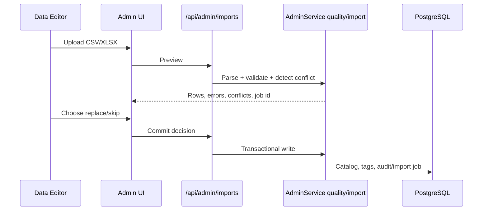

# Admin data lifecycle: quality, tag và import

## Mục tiêu

Hiểu cách dữ liệu đi từ quản trị đến planner và bảo đảm import không làm giảm chất lượng catalog.

## Nguồn sự thật

- `backend/app/modules/admin/`, `ingredients/`, `meals/`, `tags/` và `dishes/`.
- Tables `ingredients`, `nutrition_facts`, `price_snapshots`, `dishes`, `dish_ingredients`, `tag_catalog`, `import_jobs`; các view full/candidate.

## Luồng quản trị dữ liệu

Preview có thể tạo import job/audit metadata nhưng không được thay đổi ingredient/dish catalog. Commit dùng `job_id` và quyết định conflict; không tin lại dữ liệu client chưa được preview.

## Quality và typed tags

Quality issues phát hiện recipe thiếu, price/nutrition thiếu, duplicate/sai type và điều kiện làm dish không vào `v_dish_candidates`. Tag catalog tách `entity_type` `ingredient` và `dish`; cùng tên được phép ở hai loại khác nhau. Rename/active state cần cập nhật có kiểm soát để không làm JSON tag dangling.

## Quyền

`data_editor`, `admin`, `super_admin` được quản lý food data; user management và AI-provider settings yêu cầu admin/super-admin. UI navigation không thay role dependency ở API.

## Khi nào phải cập nhật tài liệu này

Cập nhật khi đổi format import/export, conflict policy, quality rule, tag typing, catalog field, role hoặc candidate eligibility.

## Kiểm tra mức độ hiểu

### Câu 1 (trắc nghiệm)

Preview import có được cập nhật catalog ngay không?

A. Có  
B. Không, chỉ commit mới ghi catalog  
C. Chỉ với XLSX

### Câu 2 (trắc nghiệm)

Tag `"healthy"` có thể tồn tại ở cả ingredient và dish không?

A. Có, vì type khác nhau  
B. Không bao giờ  
C. Chỉ khi AI tạo

### Câu 3 (trắc nghiệm)

Một dish thiếu price/nutrition ảnh hưởng gì?

A. Có thể bị loại khỏi `v_dish_candidates`  
B. Tự được AI bổ sung số liệu  
C. Vẫn luôn được planner chọn

### Câu 4 (tình huống)

Import tạo conflict code nhưng editor chọn replace. Hãy trace nguồn quyết định cuối và transaction cần kiểm tra.

### Câu 5 (tình huống)

Dashboard báo ít planner-ready dishes. Hãy nêu các nơi nên xem trước khi tăng candidate bằng tay.

## Đáp án, giải thích và bằng chứng mong đợi

1. **B.** Preview validate/detect conflict; commit mới mutation catalog.
2. **A.** Uniqueness theo type + name, không chỉ name.
3. **A.** View candidate yêu cầu data đầy đủ/hợp lệ.
4. UI gửi replace row IDs cho `job_id`; backend service đọc preview/conflict đã lưu, áp dụng transaction và cập nhật import/audit. Không dùng arbitrary replacement payload từ client.
5. Quality issues, active state, recipe ingredient, nutrition facts, price snapshots, dish type và điều kiện view candidate.

Tự chấm mỗi câu đúng/hoàn thành là 1 điểm: **5/5 = hiểu tốt; 4/5 = đạt; 3/5 = xem lại; 0–2/5 = đọc lại tài liệu và thực hành lại.**
