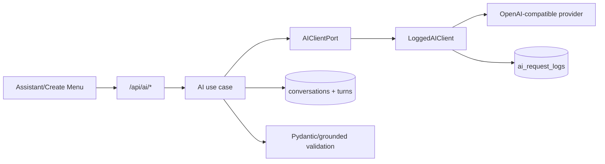

# AI: provider, SSE và ranh giới dữ liệu

## Mục tiêu

Bảo trì AI feature mà không trao quyền quyết định dữ liệu hoặc làm lộ secret/conversation.

## Nguồn sự thật

- `backend/app/modules/ai/`: `ports.py`, `client.py`, `provider_store.py`, `conversation_store.py`, `request_parser.py`, `use_cases.py`, router/schema files.
- `frontend/src/api/aiApi.ts` và `pages/ai/Assistant.tsx`.

## Kiến trúc AI

Provider config được lưu qua `ProviderConfigStore`; API key được mã hóa bằng encryption key cấu hình. Active provider không có nghĩa AI được phép quyết định business fact. `DisabledAIClient` giữ các luồng có thể fallback khi AI không được cấu hình.

## Tác vụ và authority boundary

| Tác vụ | AI làm | Hệ thống quyết định |
| --- | --- | --- |
| Parse menu request | Trích xuất mô tả ngôn ngữ | Range, enum, profile/exclusion và planner request cuối |
| Explain plan | Viết giải thích từ facts | Budget, nutrition, warning và facts được ground |
| Suggest swap | Xếp hạng candidate | Candidate eligibility và full-plan validation |
| Menuto chat | Stream hội thoại | Auth, rate/limits, persistence, retry/order |

Mọi structured output qua schema validation. Nếu provider lỗi/không active, endpoint phải trả contract AI-unavailable rõ ràng; planner form có cấu trúc và lịch sử hợp lệ vẫn hoạt động theo phạm vi hiện có.

## SSE và conversations

Chat/retry trả `text/event-stream`. Frontend `consumeChatStream` là parser tập trung. Một User tối đa 10 conversation, mỗi conversation tối đa 20 turns; chỉ turn gần nhất được retry và failed turn phải được xử lý trước lượt mới cùng conversation. Conversation inactive quá 30 ngày được cleanup background và trước read/write; request logs có retention 30 ngày riêng.

Không viết raw secret vào log/API response. Link share và conversation content cũng không được chép vào docs/example.

## Khi nào phải cập nhật tài liệu này

Cập nhật khi đổi provider setting, encryption, AI task/schema, SSE event, retention, prompt grounding, fallback hoặc logging policy.

## Kiểm tra mức độ hiểu

### Câu 1 (trắc nghiệm)

AI có được quyết định plan vượt ngân sách không?

A. Có nếu model tự tin  
B. Không, backend/checker quyết định  
C. Chỉ khi dùng provider cloud

### Câu 2 (trắc nghiệm)

Conversation history và AI request log có phải cùng một dữ liệu không?

A. Có  
B. Không, retention/purpose tách riêng  
C. Chỉ khác tên bảng

### Câu 3 (trắc nghiệm)

Ai nên parse SSE cho UI?

A. Mỗi component tự parse  
B. Consumer tập trung trong `aiApi.ts`  
C. Database trigger

### Câu 4 (tình huống)

Provider bị tắt khi User đang mở lịch sử Menuto. Hãy nêu behavior đúng và dữ liệu nào không được mất.

### Câu 5 (tình huống)

Bạn muốn thêm AI task mới trả JSON. Hãy liệt kê các checkpoint để task không bypass validation/logging.

## Đáp án, giải thích và bằng chứng mong đợi

1. **B.** AI không phải authority cho budget/nutrition/validity.
2. **B.** Conversation là product history; log là vận hành/audit.
3. **B.** Parser tập trung giúp event/error behavior nhất quán.
4. Composer chat bị khóa hoặc trả unavailable theo contract; lịch sử đã lưu vẫn đọc được và không bị xóa vì provider inactive.
5. Thêm schema/use case/port-client path, provider selection qua dependency, `LoggedAIClient`, validation/grounding, router/OpenAPI, frontend wrapper, fallback và tests.

Tự chấm mỗi câu đúng/hoàn thành là 1 điểm: **5/5 = hiểu tốt; 4/5 = đạt; 3/5 = xem lại; 0–2/5 = đọc lại tài liệu và thực hành lại.**
