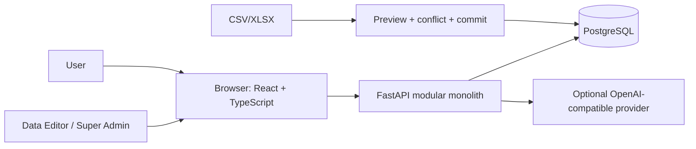
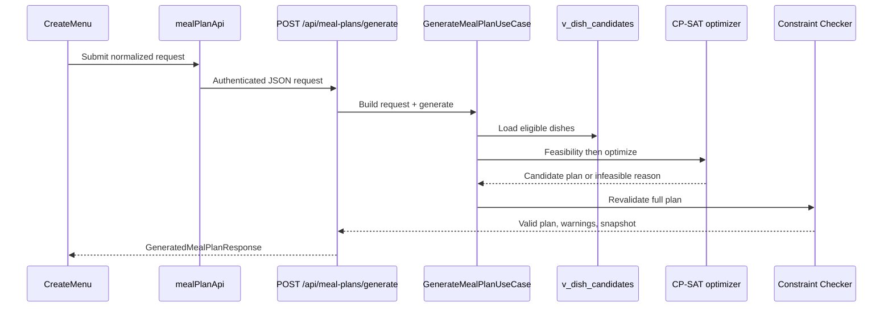

# Kiến trúc Smart Menu

## Mục tiêu

Hiểu ranh giới hệ thống, hướng phụ thuộc và các luồng quan trọng trước khi sửa code.

## Nguồn sự thật

- [FastAPI entrypoint](../../backend/app/main.py), [router composition](../../backend/app/api.py) và [dependency composition root](../../backend/app/dependencies.py).
- [Frontend route tree](../../frontend/src/app/router.tsx), layouts và route guards trong `frontend/src/components/route/`.
- [Docker topology](../../docker-compose.yml) và [baseline schema](../../data/init_db.sql).

## Thành phần và ranh giới

Frontend chỉ quản lý trải nghiệm: route, state, form và hiển thị lỗi. Backend quyết định authentication, account status, role, ownership, validation và persistence. PostgreSQL là nguồn dữ liệu nghiệp vụ; provider AI không được coi là nguồn đúng cho giá, dinh dưỡng hay tính hợp lệ.

## Quyền và điều hướng

| Role | Frontend | Backend quyền thật |
| --- | --- | --- |
| `user` | Khu User | Tài nguyên cá nhân, catalog planner-ready, AI, shopping list |
| `data_editor` | Khu Admin | Quản lý dữ liệu thực phẩm, tag, quality, import |
| `admin` | Khu Admin | Tương thích ngược như `super_admin` |
| `super_admin` | Khu Admin | User management và AI provider/log, đồng thời có quyền Data Editor |

`AdminRoute` chỉ là guard UI. Các dependency `require_data_editor`, `require_admin` và `require_super_admin` ở backend mới là enforcement cuối.

## Luồng tạo thực đơn

Không được bỏ qua `Constraint Checker`, kể cả khi solver hoặc AI đã trả kết quả. Regenerate dùng signature thực đơn trước để yêu cầu phương án khác; swap chỉ hiện khi phương án thay thế vẫn qua validation toàn plan.

## Hướng phụ thuộc

- Router biết HTTP và `Depends`, không chứa business rule dài.
- Schema là contract HTTP; domain/use case không phụ thuộc React hoặc FastAPI response type.
- Use case điều phối domain/repository/port.
- Port là abstraction cần thiết cho persistence hoặc AI; adapter SQL/provider hiện thực port.
- `dependencies.py` là nơi wiring implementation vào use case. Tránh import repository SQL trực tiếp vào domain.

## Khi nào phải cập nhật tài liệu này

Cập nhật khi thêm service, role, external provider, route tree/layout, module backend, thay đổi ownership hoặc thay đổi hướng dependency.

## Kiểm tra mức độ hiểu

### Câu 1 (trắc nghiệm)

Tầng nào là nơi enforce role và ownership cuối cùng?

A. `AdminRoute` React  
B. FastAPI dependency/router/use case  
C. Nút ẩn trên giao diện

### Câu 2 (trắc nghiệm)

Nguồn món nào được planner hiện tại dùng?

A. Toàn bộ bảng `meals`  
B. `v_dish_candidates`  
C. Câu trả lời từ AI

### Câu 3 (trắc nghiệm)

Vai trò phù hợp của provider AI là gì?

A. Quyết định ngân sách hợp lệ  
B. Thay thế database khi dữ liệu thiếu  
C. Parse/giải thích/xếp hạng trong ranh giới đã kiểm tra

### Câu 4 (tình huống)

Một User sửa request HTTP để gọi endpoint Admin. Hãy trace các lớp ngăn thao tác này và kết quả mong đợi.

### Câu 5 (tình huống)

Một plan có vẻ hợp lý từ CP-SAT nhưng chứa nguyên liệu bị loại trừ. Hãy nêu bước nào phải chặn plan và nơi cần điều tra.

## Đáp án, giải thích và bằng chứng mong đợi

1. **B.** UI guard chỉ cải thiện trải nghiệm; backend mới xác thực Bearer token, trạng thái account, role và ownership.
2. **B.** Router dishes và candidate provider đọc `v_dish_candidates`; view đã lọc dữ liệu/planner readiness.
3. **C.** AI không phải nguồn sự thật cho giá, nutrition hoặc validity.
4. Frontend có thể redirect, nhưng request trực tiếp vẫn đến backend; dependency role trả `403` trước business operation. Kiểm tra router và `core/deps.py`.
5. `validate_plan` trong Constraint Checker phải trả invalid trước response. Điều tra candidate eligibility, exclusion request và checker; không vá bằng cách chỉ ẩn món ở UI.

Tự chấm mỗi câu đúng/hoàn thành là 1 điểm: **5/5 = hiểu tốt; 4/5 = đạt; 3/5 = xem lại; 0–2/5 = đọc lại tài liệu và thực hành lại.**
