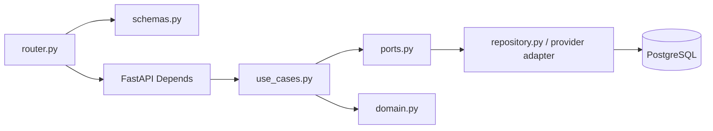

# Backend: module, contract và persistence

## Mục tiêu

Biết cách thêm hoặc sửa backend mà không phá layering, contract HTTP hoặc dữ liệu hiện có.

## Nguồn sự thật

- `backend/app/main.py`, `api.py`, `dependencies.py`, `core/` và `shared/`.
- `backend/app/modules/<feature>/` cùng tests tương ứng trong `backend/app/tests/`.

## Cấu trúc thực thi

`main.py` cài CORS, lifespan và AppException handler. Lifespan chạy cleanup conversation/request-log retention nhưng không để cleanup failure làm liveness/readiness fail. `api.py` gom router; mọi router mới phải được include ở đây.

## Module map

| Module | Trách nhiệm chính | Điểm cần cẩn trọng |
| --- | --- | --- |
| `identity` | Register/login/JWT/Google/user CRUD | Token, user active, Gmail verification |
| `profiles` + `nutrition` | Hồ sơ, exclusions, nutrition target, AI consent | Input profile thiếu và notice version stale phải trả lỗi rõ |
| `ingredients`, `meals`, `dishes`, `tags` | Catalog và contract đọc/ghi | `dishes` là nguồn planner-ready hiện tại |
| `meal_planning` | Generate/save/history/snapshot | Solver luôn đi qua checker |
| `shopping_lists` | Aggregate, purchased state, public share | Token scope, expiry, revoke |
| `ai` | Provider, SSE, parse/explain/swap/chat/personalization | Consent, purpose mode, context/state DB, RLS, citation, logging |
| `admin` | User/data/quality/import/export | Role và preview-before-commit |

## Error và transaction

- Domain/use case dùng `AppException` subclasses cho lỗi nghiệp vụ. `main.py` chuyển thành `{ "detail": ... }` với status phù hợp.
- FastAPI/Pydantic validation giữ response `422` chuẩn; đừng bọc lại làm mất field error.
- Repository SQL chịu trách nhiệm đọc/ghi; use case giữ quy tắc nghiệp vụ và ownership.
- Thao tác import commit hoặc mutation nhiều bảng phải kết thúc atomically; preview không được ghi dữ liệu catalog.

## Dependency injection

`dependencies.py` là composition root. Một use case mới cần factory dependency riêng, rồi router inject qua `Depends`. AI client được chọn từ active provider và bọc `LoggedAIClient`; không khởi tạo provider client rải rác trong router/page.

AI hiện dùng ba session: primary cho config/prompt, context session read-only cho profile/tag/candidate, state session cho consent/conversation/log. `AuthenticatedAIRequestScope` luôn lấy actor từ JWT rồi đặt `app.current_user_id` để RLS lọc đúng User. Ngoài development, AI bật mà thiếu `AI_CONTEXT_DATABASE_URL` hoặc `AI_STATE_DATABASE_URL` thì Settings từ chối khởi động.

Lưu ý vận hành hiện tại: retention loop vẫn mở primary `engine`. Nếu AI state được đặt ở database khác, cần kiểm chứng và điều chỉnh cleanup path trước production.

## Dòng lỗi nên debug

1. Đọc `router.py` để xác định request, role và response model.
2. Đọc factory trong `dependencies.py` để biết implementation thật.
3. Đọc use case/domain để tìm business rule.
4. Đọc repository/view SQL để xác nhận data shape.
5. Tìm `backend/app/tests/test_<feature>/` hoặc test data tương ứng trước khi sửa.

## Khi nào phải cập nhật tài liệu này

Cập nhật khi thêm module, router, dependency factory, exception mapping, transaction boundary, repository adapter hoặc background task.

## Kiểm tra mức độ hiểu

### Câu 1 (trắc nghiệm)

Router mới nhưng không xuất hiện trong OpenAPI thường thiếu bước nào?

A. Include router ở `api.py`  
B. Thêm Tailwind class  
C. Chụp screenshot

### Câu 2 (trắc nghiệm)

Factory nối use case với SQL repository nên nằm ở đâu?

A. `pages/` frontend  
B. `dependencies.py`  
C. `data/samples/`

### Câu 3 (trắc nghiệm)

Lỗi Pydantic request body thông thường trả status nào?

A. 204  
B. 422  
C. 503

### Câu 4 (tình huống)

Bạn thêm endpoint đọc dữ liệu mới. Hãy nêu chuỗi file tối thiểu phải thay đổi và nơi đăng ký router.

### Câu 5 (tình huống)

Import preview đang làm thay đổi database. Hãy nêu boundary cần kiểm tra để sửa đúng nơi.

## Đáp án, giải thích và bằng chứng mong đợi

1. **A.** Router phải được import/include bởi composition router.
2. **B.** Đây là nơi dependency wiring tập trung.
3. **B.** Giữ lỗi validation chuẩn để frontend/API docs nhất quán.
4. Schema nếu có contract mới → use case/domain/port/repository cần thiết → router → factory dependency → `api.py` → test → API reference.
5. Router preview chỉ gọi service preview; kiểm tra `AdminService` và transaction/repository để bảo đảm preview không gọi commit/write path.

Tự chấm mỗi câu đúng/hoàn thành là 1 điểm: **5/5 = hiểu tốt; 4/5 = đạt; 3/5 = xem lại; 0–2/5 = đọc lại tài liệu và thực hành lại.**
