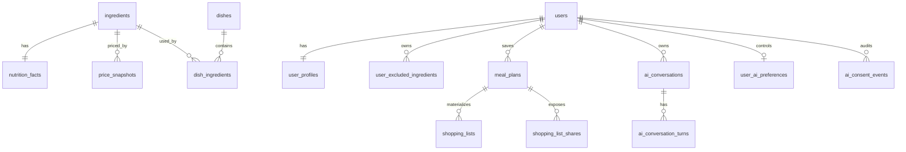

# Database và migrations

## Mục tiêu

Hiểu dữ liệu nguồn, derived view và quy trình thay đổi schema an toàn.

## Nguồn sự thật

- [Baseline schema](../../data/init_db.sql).
- [Migration runner guide](../../data/migrations/README.md) và các file `data/migrations/*.sql`.
- SQL repositories/use cases trong `backend/app/modules/`.

## Inventory hiện tại

| Nhóm | Đối tượng |
| --- | --- |
| Identity/profile | `users`, `user_profiles`, `user_excluded_ingredients`, `user_ai_preferences`, `ai_consent_events` |
| Food data | `ingredients`, `nutrition_facts`, `price_snapshots`, `meals`, `meal_ingredients`, `dishes`, `dish_ingredients`, `tag_catalog` |
| Planner/shopping | `meal_plans`, `shopping_lists`, `shopping_list_shares` |
| AI/Admin | `llm_provider_configs`, `ai_request_logs`, `ai_conversations`, `ai_conversation_turns`, `import_jobs`, `audit_logs` |
| Views | `v_ingredients_full`, `v_meals_full`, `v_dishes_full`, `v_dish_candidates`, `v_meal_plan_summary` |

Có thêm enum `ingredient_purchase_mode` (`regular`, `pantry`, `ignored`) bên cạnh các enum role, profile, meal/dish, cooking method, food group và exclusion reason. Không hard-code enum mới ở frontend nếu database/backend chưa hỗ trợ.

## Quan hệ quan trọng

`v_dish_candidates` là boundary dữ liệu quan trọng: chỉ dishes active có công thức, ingredient active, nutrition hợp lệ và dữ liệu giá phù hợp với `purchase_mode` mới đi vào catalog User/planner. View mang theo bước mua, hạn bảo quản, mật độ dinh dưỡng và giới hạn tăng công thức cho Planner V3. Không đổi query planner sang bảng `dishes` thô để “sửa nhanh” một missing candidate.

## Baseline và migration

- Database mới được tạo từ `init_db.sql` trong Docker PostgreSQL init.
- Database tồn tại dùng `uv run python scripts/apply_migrations.py` từ `backend`; runner ghi `schema_migrations` và không chạy lại file đã nhận.
- Migration là bất biến sau khi đã dùng ở môi trường demo. Tạo file SQL mới có tiền tố ngày/ý nghĩa; không sửa migration lịch sử để thay đổi database đã tồn tại.
- Sao lưu trước migration dữ liệu demo. DDL destructive hoặc data reset phải có ADR, kế hoạch backup và xác nhận phạm vi.

Migration `20260722_ai_personalization_boundary.sql` thêm consent/audit, conversation mode, turn grounding/citations, provider web-search capability, hai database role giới hạn quyền và RLS. `menuto_ai_context_reader` chỉ đọc projection cần cho Menuto và mặc định transaction read-only; `menuto_ai_state_writer` chỉ ghi bảng consent/history/log. RLS so actor với `app.current_user_id` do backend đặt từ token.

## Snapshot và dữ liệu dẫn xuất

`meal_plans.plan_data` lưu snapshot plan để lịch sử không thay đổi ngầm khi catalog đổi. Snapshot V3 còn lưu fingerprint nguồn, block mua, allocation, storage, base/final nutrition và adjustment. Giá/nutrition hiển thị cho candidate được tính từ ingredient recipe và price snapshot. `shopping_lists` materialize trạng thái mua theo `item_key` để cùng một ingredient có nhiều ngày mua vẫn giữ checkbox độc lập; share token không cấp quyền đọc toàn bộ plan/user profile.

## Khi nào phải cập nhật tài liệu này

Cập nhật khi thêm/bỏ bảng, column, enum, view, index, migration, retention job, ownership hoặc snapshot shape.

## Kiểm tra mức độ hiểu

### Câu 1 (trắc nghiệm)

Nguồn đúng cho candidate planner là gì?

A. `dishes` không lọc  
B. `v_dish_candidates`  
C. JSON frontend cache

### Câu 2 (trắc nghiệm)

Database đã tồn tại nên nhận thay đổi schema bằng cách nào?

A. Chạy lại toàn bộ `init_db.sql`  
B. Migration runner theo file SQL mới  
C. Sửa trực tiếp production bằng UI

### Câu 3 (trắc nghiệm)

Vì sao meal plan cần snapshot?

A. Để lịch sử không thay đổi khi catalog/giá thay đổi  
B. Để bỏ validation  
C. Để share token vĩnh viễn

### Câu 4 (tình huống)

Bạn cần thêm một field bắt buộc cho ingredient. Hãy nêu các lớp và migration cần rà soát.

### Câu 5 (tình huống)

Một dish không xuất hiện cho User dù bản ghi `dishes` tồn tại. Hãy nêu cách debug không phá invariant planner.

## Đáp án, giải thích và bằng chứng mong đợi

1. **B.** View bảo vệ quality invariant cho catalog/planner.
2. **B.** Baseline chỉ dành cho database mới.
3. **A.** History phải có dữ liệu truy vết tại thời điểm tạo.
4. Tạo migration mới, cập nhật baseline schema, backend write/read schema, validation/import/export, view/quality query, frontend type/form và test.
5. So sánh dish với điều kiện `v_dish_candidates`: active, recipe, ingredient active, nutrition/price hợp lệ, tổng dương; sửa dữ liệu hoặc quality rule thay vì bypass view.

Tự chấm mỗi câu đúng/hoàn thành là 1 điểm: **5/5 = hiểu tốt; 4/5 = đạt; 3/5 = xem lại; 0–2/5 = đọc lại tài liệu và thực hành lại.**
