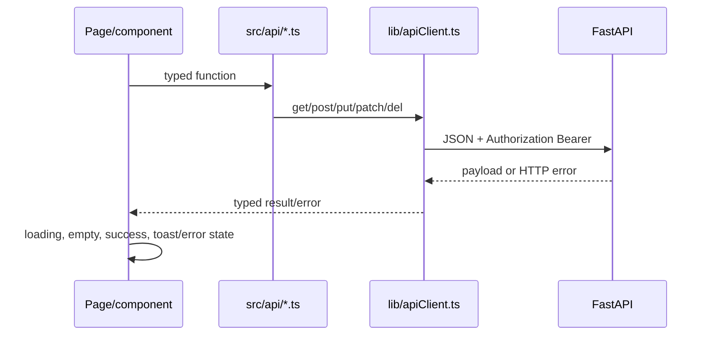

# Frontend: route, state và API integration

## Mục tiêu

Trace được giao diện React tới backend contract, thêm màn hình mới đúng layout/guard và xử lý lỗi nhất quán.

## Nguồn sự thật

- [Route tree](../../frontend/src/app/router.tsx), `app/layouts/`, `context/AuthContext.tsx`.
- `pages/`, `components/`, `api/`, `types/` và `lib/apiClient.ts` trong `frontend/src/`.

## Bản đồ route

| Khu | Route tiêu biểu | Guard/layout |
| --- | --- | --- |
| Public | `/`, `/share/shopping-list/:token` | Không token; link share có scope riêng |
| Auth | `/login`, `/register` | `AuthLayout` |
| User | `/dashboard`, `/profile`, `/create-menu`, `/history`, `/meals`, `/shopping-list`, `/ai-chat` | `UserRoute` + `MainLayout` |
| Admin | `/admin`, users, ingredients, dishes, quality, imports, AI, tags | `AdminRoute` + `AdminLayout` |

`UserRoute` hiện redirect role Admin sang `/admin`; `AdminRoute` cho phép `data_editor`, `admin`, `super_admin` vào khu Admin UI. Backend vẫn kiểm tra chi tiết từng API.

## Luồng gọi API

Không gọi `fetch` trực tiếp trong page trừ phần streaming đã được tập trung ở `aiApi.ts`. API wrapper là nơi giữ path, request type và mapping response. Khi contract đổi, sửa wrapper/type trước rồi sửa page.

## Auth và lỗi

`AuthContext` đọc session hiện tại qua auth API, quản lý loading và user state. `apiClient` thêm access token, xử lý response không thành công và cung cấp public request không có Bearer cho shopping-share. Không hiển thị token, raw provider secret hoặc raw server error nhạy cảm trong UI.

## Menuto SSE

`aiApi.ts` có consumer stream tập trung cho chat/retry. UI phải khóa thao tác gửi/retry đồng thời, render event theo thứ tự và giữ câu trả lời lỗi theo contract. Không đổi SSE parser trong component riêng lẻ.

## Checklist thêm page

1. Xác định role/layout/guard và route lazy import trong `router.tsx`.
2. Thêm typed API wrapper hoặc mở rộng wrapper đúng domain.
3. Dùng component UI/domain tái sử dụng khi phù hợp.
4. Có loading, empty, error, success và keyboard/focus state.
5. Thêm mapping vào frontend section của API docs và test/build.

## Khi nào phải cập nhật tài liệu này

Cập nhật khi đổi route, guard, layout, auth state, API wrapper, shared component contract, SSE behavior hoặc responsive limitation.

## Kiểm tra mức độ hiểu

### Câu 1 (trắc nghiệm)

Nơi thích hợp để giữ URL `/api/meal-plans/generate` là gì?

A. JSX của button  
B. API wrapper theo domain  
C. CSS file

### Câu 2 (trắc nghiệm)

`AdminRoute` có thay backend authorization không?

A. Có, vì redirect đã đủ  
B. Không, backend dependency vẫn quyết định  
C. Chỉ khi dùng Chrome

### Câu 3 (trắc nghiệm)

Public shopping list khác request User thông thường ở điểm nào?

A. Không có Bearer token; dùng share token trong path  
B. Không dùng HTTP  
C. Không có response schema

### Câu 4 (tình huống)

Endpoint AI đổi response field. Hãy nêu thứ tự thay đổi frontend để TypeScript chỉ ra nơi bị ảnh hưởng.

### Câu 5 (tình huống)

Một data editor thấy menu Admin nhưng gọi API user management bị 403. Đây có phải lỗi guard frontend không? Giải thích nơi cần kiểm tra.

## Đáp án, giải thích và bằng chứng mong đợi

1. **B.** Page gọi wrapper, wrapper gọi client.
2. **B.** Guard chỉ điều hướng; backend kiểm role chi tiết.
3. **A.** Link public là bearer-like capability có phạm vi/hạn dùng riêng.
4. Sửa type/consumer trong `aiApi.ts` trước, để compiler chỉ page/component dùng field cũ; sau đó cập nhật loading/error render và API docs.
5. Không nhất thiết. `data_editor` được vào Admin UI nhưng backend user management yêu cầu admin/super admin; kiểm tra dependency endpoint và role matrix.

Tự chấm mỗi câu đúng/hoàn thành là 1 điểm: **5/5 = hiểu tốt; 4/5 = đạt; 3/5 = xem lại; 0–2/5 = đọc lại tài liệu và thực hành lại.**
