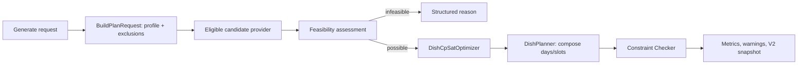

# Meal planner: CP-SAT và validation độc lập

## Mục tiêu

Sửa planner mà vẫn giữ tính khả thi, khả năng giải thích và an toàn dữ liệu.

## Nguồn sự thật

- `backend/app/modules/meal_planning/`: `domain.py`, `composition.py`, `feasibility.py`, `optimizer.py`, `planner.py`, `constraint_checker.py`, `use_cases.py`, `schemas.py`.
- Candidate SQL provider và `v_dish_candidates` trong database.

## Pipeline

## Request và cấu trúc bữa

Request hợp lệ có 1–7 ngày, 2 hoặc 3 bữa/ngày, budget, nutrition target và preference/exclusion từ form/hồ sơ. Hai bữa gồm lunch/dinner; ba bữa thêm breakfast. Mỗi lunch/dinner cần đúng một staple, một savory và một vegetable side **hoặc** soup. Breakfast là một breakfast dish.

## Ràng buộc

| Loại | Ví dụ |
| --- | --- |
| Hard | Đủ ngày/slot, đúng dish type, ingredient không bị loại trừ, candidate có dữ liệu, budget không vượt, plan ownership khi save |
| Soft | Gần calorie/macro target, đa dạng, preferred tags, chi phí thấp hơn trong miền hợp lệ |

Feasibility chạy trước solver để trả `infeasible` có reason code khi budget tối thiểu, pool dish type hoặc nutrition range không đáp ứng. Không thay infeasible bằng menu thiếu bữa/chứa dữ liệu lỗi.

## Solver và checker

`DishCpSatOptimizer` tìm nghiệm hard constraint rồi tối ưu objective theo các giai đoạn. `DishPlanner` chuyển lựa chọn solver thành `ComposedMeal`/day. `validate_plan` trong `constraint_checker.py` tính lại điều kiện từ candidate và request; response chỉ được tạo sau validation thành công.

Regenerate truyền signature plan cũ để loại phương án trùng. Swap có thể dùng AI để xếp hạng candidate, nhưng `SuggestSwapUseCase` phải xây request và kiểm plan thay thế qua checker trước khi trả về.

## Debug theo symptom

- `infeasible`: đọc `feasibility.py`, candidate pool theo `DishType`, budget min và reason code trước.
- Solver có result nhưng API lỗi: inspect composition/checker, không chỉ tăng timeout.
- Menu không đa dạng: inspect soft objective và signature/regenerate rather than hard-rule bypass.
- Plan cũ không save: inspect snapshot schema/ownership và `SaveMealPlanUseCase`.

## Khi nào phải cập nhật tài liệu này

Cập nhật khi đổi request shape, dish composition, candidate invariant, solver objective, reason code, checker rule, snapshot hoặc regenerate/swap behavior.

## Kiểm tra mức độ hiểu

### Câu 1 (trắc nghiệm)

Điều nào là hard constraint?

A. Ưu tiên tag  
B. Không vượt ngân sách  
C. Chi phí thấp hơn trong các plan hợp lệ

### Câu 2 (trắc nghiệm)

Sau CP-SAT, bước nào bắt buộc trước response?

A. Constraint Checker  
B. Chụp screenshot  
C. Gọi AI chat

### Câu 3 (trắc nghiệm)

Regenerate chống lại điều gì?

A. Lịch sử User  
B. Trả lại đúng signature thực đơn cũ  
C. Database migration

### Câu 4 (tình huống)

User có budget quá thấp. Hãy nêu response mong đợi và những bước không được làm.

### Câu 5 (tình huống)

Bạn muốn thêm constraint “không lặp một dish trong hai ngày liên tiếp”. Hãy nêu các artifact phải thay đổi và test cần bổ sung.

## Đáp án, giải thích và bằng chứng mong đợi

1. **B.** Hard constraint xác định miền nghiệm; tag/cost ranking là soft objective.
2. **A.** Checker là tuyến phòng thủ độc lập với solver/AI.
3. **B.** Signature buộc lần tạo lại khác plan trước.
4. Trả `infeasible` với reason minh bạch từ feasibility; không tạo menu thiếu cấu trúc, không vượt budget và không gọi AI để bịa số liệu.
5. Cập nhật request/domain nếu cần, feasibility/optimizer constraint, checker tương ứng, regenerate semantics, API docs và tests feasible/infeasible/regression.

Tự chấm mỗi câu đúng/hoàn thành là 1 điểm: **5/5 = hiểu tốt; 4/5 = đạt; 3/5 = xem lại; 0–2/5 = đọc lại tài liệu và thực hành lại.**
