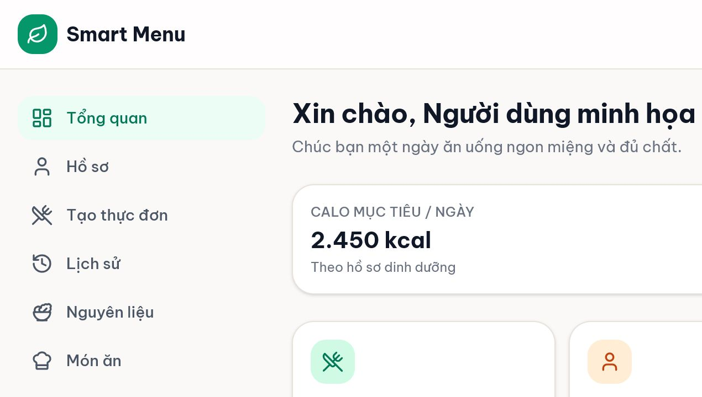
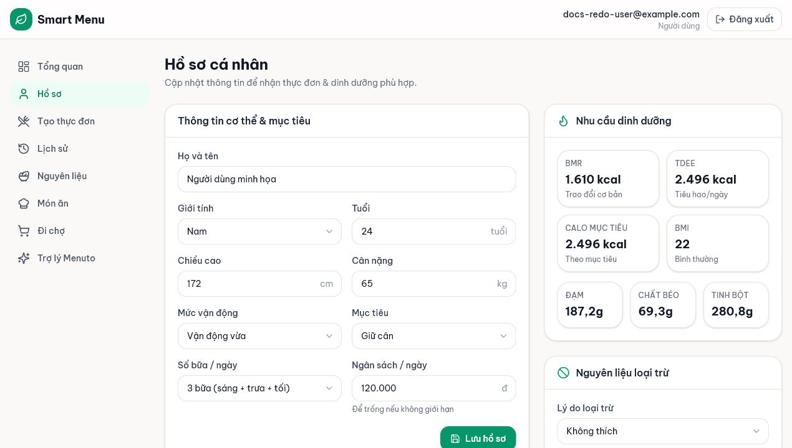

# 01 — Đăng nhập, dashboard và hồ sơ

## Mục tiêu

Tạo hoặc đăng nhập tài khoản, hiểu dashboard và hoàn thiện hồ sơ để hệ thống tính nhu cầu dinh dưỡng tham khảo, ngân sách và nguyên liệu cần loại trừ.

## Vai trò phù hợp

**User.** Tài khoản quản trị sẽ được chuyển vào khu quản trị sau khi đăng nhập.

## Điều kiện trước khi bắt đầu

- Có trình duyệt và địa chỉ Smart Menu.
- Nếu đăng ký bằng email: dùng email hợp lệ và mật khẩu 8–128 ký tự.
- Nút Google chỉ xuất hiện khi hệ thống đã cấu hình Google; phiên bản hiện tại chỉ nhận tài khoản Gmail đã được Google xác minh.

## Các bước thực hiện

1. Ở trang **Đăng ký**, nhập họ tên (có thể bỏ trống), email, mật khẩu và xác nhận mật khẩu; chọn **Đăng ký**. Hoặc chọn nút Google nếu nút này xuất hiện.
2. Lần sau, dùng **Đăng nhập** với email/mật khẩu hoặc cùng tài khoản Google. Không trộn hai email khác nhau nếu muốn giữ chung dữ liệu.
3. Tại **Tổng quan**, kiểm tra tên chào, calo mục tiêu/ngày, ngân sách/ngày và thực đơn gần đây. Banner “Hoàn thiện hồ sơ” nghĩa là còn thiếu giới tính, tuổi, chiều cao hoặc cân nặng.
4. Mở **Hồ sơ**. Nhập giới tính, tuổi, chiều cao, cân nặng, mức vận động, mục tiêu, số bữa/ngày và ngân sách/ngày. Chọn **Lưu hồ sơ**.
5. Quan sát khung **Nhu cầu dinh dưỡng**. Hệ thống tính BMR, TDEE, BMI và macro khi bốn thông tin cơ thể bắt buộc đã đủ; backend tự tính lại calo mục tiêu, không nhận một con số calo do trình duyệt tự áp đặt.
6. Trong **Nguyên liệu loại trừ**, chọn lý do **Dị ứng** hoặc **Không thích**, tìm nguyên liệu rồi chọn để thêm. Dùng nút xóa ở từng dòng nếu muốn bỏ loại trừ.

## Kết quả nhìn thấy

- Dashboard không còn nhắc hoàn thiện hồ sơ.
- Calo mục tiêu và ngân sách hiển thị theo hồ sơ đã lưu.
- Khung dinh dưỡng có BMR, TDEE, BMI, đạm, chất béo và tinh bột.
- Nguyên liệu loại trừ xuất hiện cùng nhãn lý do; planner sẽ loại mọi món chứa nguyên liệu đó.

## Ảnh minh họa có chú thích

Chú thích đọc ảnh: (1) thanh điều hướng bên trái; (2) calo mục tiêu; (3) ngân sách/ngày; (4) thực đơn gần đây hoặc trạng thái rỗng.

Chú thích đọc ảnh: (1) thông tin cơ thể; (2) mục tiêu và số bữa; (3) preview dinh dưỡng; (4) vùng thêm nguyên liệu loại trừ.

## Lỗi thường gặp và trạng thái lỗi

- **Mật khẩu xác nhận không khớp:** nhập lại hai ô giống nhau.
- **Không thấy nút Google:** hệ thống chưa cấu hình Google; dùng email/mật khẩu.
- **Không có preview dinh dưỡng:** kiểm tra giới tính, tuổi, chiều cao và cân nặng.
- **Nguyên liệu đã có trong danh sách:** không thêm trùng; đổi lý do bằng cách xóa rồi thêm lại.
- **Tài khoản bị khóa:** liên hệ Quản trị hệ thống; đăng nhập sẽ bị từ chối.

## Lưu ý an toàn

- Không chia sẻ mật khẩu hoặc access token. Smart Menu không yêu cầu gửi mật khẩu qua chat.
- Đánh dấu đúng dị ứng; tuy vậy kết quả vẫn không thay thế tư vấn y tế.
- AI chỉ phân tích/giải thích; chi phí, dinh dưỡng, dị ứng, ngân sách và tính hợp lệ được hệ thống kiểm tra.

## Kiểm tra mức độ hiểu

### Câu 1 (trắc nghiệm)

Nhóm thông tin nào cần đủ để preview dinh dưỡng xuất hiện?

A. Họ tên, email, ngân sách, số bữa  
B. Giới tính, tuổi, chiều cao, cân nặng  
C. Chỉ cân nặng và mục tiêu

### Câu 2 (trắc nghiệm)

Khi không thấy nút đăng nhập Google, cách hiểu đúng là gì?

A. Tài khoản đã bị khóa  
B. Google có thể chưa được cấu hình; vẫn dùng email/mật khẩu  
C. Phải đổi sang trình duyệt khác

### Câu 3 (trắc nghiệm)

Điều gì xảy ra với nguyên liệu đã thêm vào “Nguyên liệu loại trừ”?

A. Chỉ bị ẩn khỏi trang nguyên liệu  
B. Món chứa nguyên liệu đó bị loại khỏi planner  
C. AI tự quyết có loại hay không

### Câu 4 (tình huống)

Dashboard hiện banner “Hoàn thiện hồ sơ” và không có calo mục tiêu. Hãy nêu các bước bạn sẽ làm để xử lý.

### Câu 5 (tình huống)

Bạn bị dị ứng đậu phộng nhưng đã thêm nhầm lý do “Không thích”. Hãy mô tả cách sửa và cách tự kiểm tra kết quả.

## Đáp án, giải thích và kết quả

1. **B.** Bốn thông tin cơ thể là đầu vào tối thiểu để tính preview.
2. **B.** Nút Google được ẩn khi thiếu cấu hình; email/mật khẩu vẫn hoạt động.
3. **B.** Cả dị ứng và không thích đều trở thành nguyên liệu loại trừ cứng cho planner.
4. Mở **Hồ sơ** → bổ sung giới tính, tuổi, chiều cao, cân nặng → kiểm tra mức vận động/mục tiêu → **Lưu hồ sơ** → quay lại dashboard và xác nhận calo đã xuất hiện.
5. Xóa dòng đậu phộng → chọn lý do **Dị ứng** → thêm lại đậu phộng → xác nhận dòng có nhãn Dị ứng; khi tạo menu, không được có món chứa đậu phộng.

Tự chấm mỗi câu đúng/hoàn thành là 1 điểm: **5/5 = hiểu tốt; 4/5 = đạt; 3/5 = xem lại; 0–2/5 = đọc lại và thực hành lại.**

