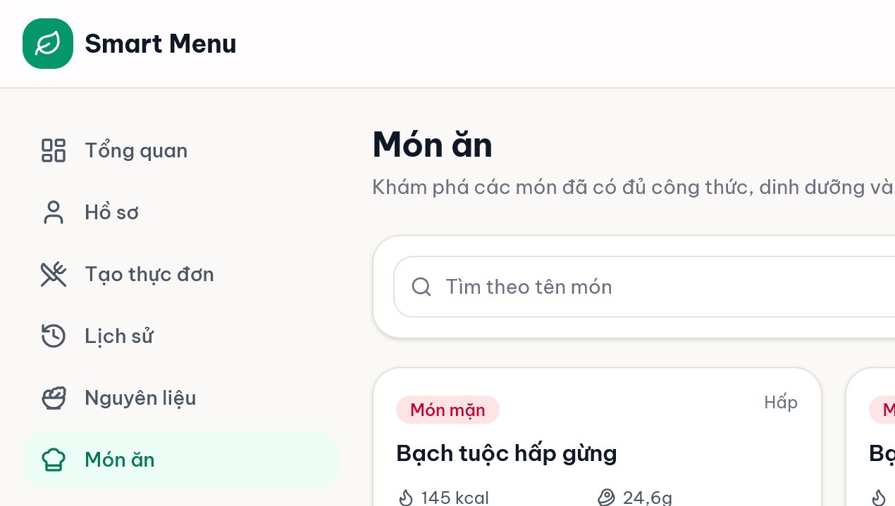
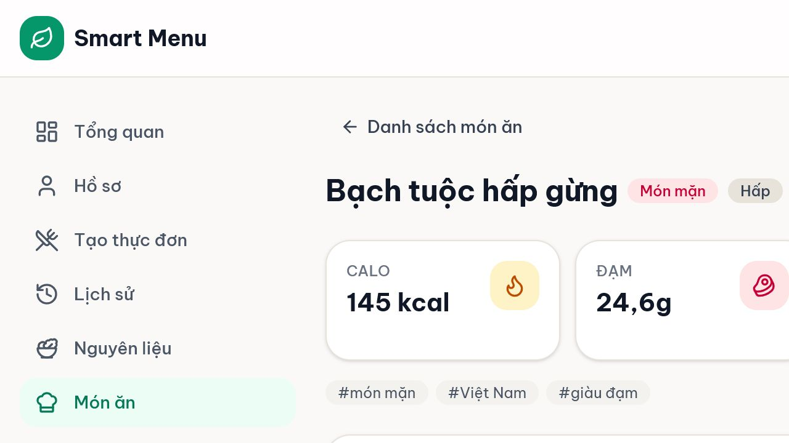

# 02 — Nguyên liệu, món ăn và chi tiết món

## Mục tiêu

Tra cứu nguyên liệu, tìm món đủ dữ liệu cho planner và đọc công thức, giá cùng dinh dưỡng của một món.

## Vai trò phù hợp

**User.** User chỉ tra cứu; thao tác sửa dữ liệu thuộc khu quản trị.

## Điều kiện trước khi bắt đầu

- Đã đăng nhập User.
- Database đã có dữ liệu nguyên liệu và món thành phần.

## Các bước thực hiện

1. Mở **Nguyên liệu**. Nhập một phần tên vào ô tìm kiếm hoặc chọn nhóm Đạm, Rau củ, Tinh bột, Sữa, Chất béo, Trái cây hay Khác.
2. Giữ **Chỉ hiển thị đang dùng** nếu chỉ cần dữ liệu hiện hành. Đọc calo/đạm trên 100g và giá tham khảo; dòng “Quy đổi” là giá theo đơn vị công thức dùng để tính món.
3. Mở **Món ăn**. Tìm theo tên hoặc lọc loại món: Tinh bột, Món mặn, Canh, Rau/Món phụ hoặc Món sáng.
4. Đọc thẻ món, calo, đạm, chất béo và chi phí trên thẻ. Danh mục này chỉ hiển thị món planner-ready: món active, có công thức, giá và dinh dưỡng đầy đủ.
5. Chọn một thẻ món để mở **Chi tiết món ăn**. Kiểm tra loại món, cách chế biến, tổng macro, chi phí, mô tả, cách làm và từng nguyên liệu/định lượng.
6. Dùng **Danh sách món ăn** để quay lại. Nếu món đã bị ẩn hoặc không còn đủ dữ liệu, trang chi tiết sẽ báo không tìm thấy.

## Kết quả nhìn thấy

- Bộ lọc làm danh sách ngắn lại theo từ khóa/nhóm/loại món.
- Mỗi món hiển thị số liệu tổng được tính từ công thức.
- Trang chi tiết cho biết món gồm gì và chi phí từng nguyên liệu.

## Ảnh minh họa có chú thích

Chú thích đọc ảnh: (1) ô tìm kiếm; (2) bộ lọc nhóm; (3) công tắc chỉ dữ liệu đang dùng; (4) bảng calo, đạm và giá.

Chú thích đọc ảnh: (1) tìm món; (2) lọc loại; (3) thẻ món; (4) calo/macro/chi phí và tag.

Chú thích đọc ảnh: (1) loại món và cách chế biến; (2) tổng dinh dưỡng/chi phí; (3) mô tả/cách làm; (4) nguyên liệu và định lượng.

## Lỗi thường gặp và trạng thái lỗi

- **Không có kết quả:** xóa từ khóa hoặc đưa bộ lọc về “Tất cả”.
- **Không thấy món Admin vừa tạo:** món có thể đang ẩn hoặc thiếu công thức/giá/dinh dưỡng nên chưa planner-ready.
- **Giá gốc khác giá quy đổi:** đây là hai đơn vị khác nhau; planner dùng giá quy đổi theo đơn vị công thức.
- **Trang chi tiết báo không tìm thấy:** quay lại danh mục; món không còn thuộc candidate hợp lệ.

## Lưu ý an toàn

- Giá là snapshot tham khảo, có thể khác nơi mua và thời điểm hiện tại.
- Không suy diễn số liệu thành khuyến nghị điều trị bệnh.
- AI chỉ phân tích/giải thích; chi phí, dinh dưỡng, dị ứng, ngân sách và tính hợp lệ được hệ thống kiểm tra.

## Kiểm tra mức độ hiểu

### Câu 1 (trắc nghiệm)

“Planner-ready” nghĩa là gì?

A. Món được nhiều người thích  
B. Món active và đủ công thức, giá, dinh dưỡng hợp lệ  
C. Món do AI tự tạo

### Câu 2 (trắc nghiệm)

Planner dùng loại giá nào để tính chi phí món?

A. Giá quy đổi theo đơn vị công thức  
B. Giá do User đoán  
C. Giá AI tìm trên Internet

### Câu 3 (trắc nghiệm)

Vì sao một món có trong khu Admin nhưng không xuất hiện ở danh mục User?

A. User chưa hỏi Menuto  
B. Món đang ẩn hoặc thiếu dữ liệu bắt buộc  
C. Món có nhiều nguyên liệu

### Câu 4 (tình huống)

Bạn muốn tìm một món sáng giàu đạm và xem món gồm những gì. Hãy mô tả thao tác.

### Câu 5 (tình huống)

Bạn tìm “đậu” nhưng không có kết quả dù biết dữ liệu tồn tại. Hãy nêu ít nhất hai kiểm tra trước khi báo lỗi.

## Đáp án, giải thích và kết quả

1. **B.** Candidate phải qua cổng chất lượng dữ liệu.
2. **A.** Giá quy đổi làm các đơn vị khác nhau có thể cộng đúng trong công thức.
3. **B.** Danh mục User và planner cùng dùng nguồn món đủ điều kiện.
4. Mở **Món ăn** → chọn loại **Món sáng** → nhập từ khóa/tag phù hợp → chọn thẻ món → đọc phần macro, chi phí và danh sách nguyên liệu.
5. Xóa/đổi từ khóa; đưa nhóm/loại về “Tất cả”; kiểm tra “Chỉ hiển thị đang dùng”; nếu là món, nhờ Admin kiểm tra trạng thái và chất lượng dữ liệu.

Tự chấm mỗi câu đúng/hoàn thành là 1 điểm: **5/5 = hiểu tốt; 4/5 = đạt; 3/5 = xem lại; 0–2/5 = đọc lại và thực hành lại.**

