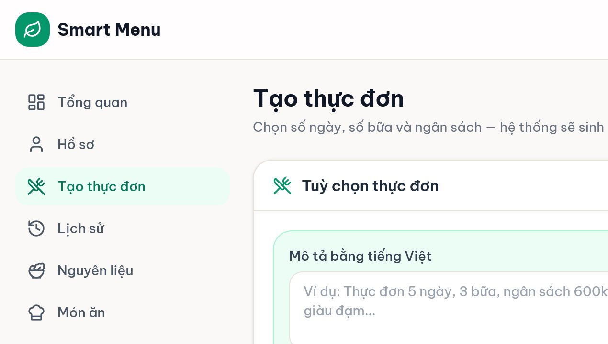
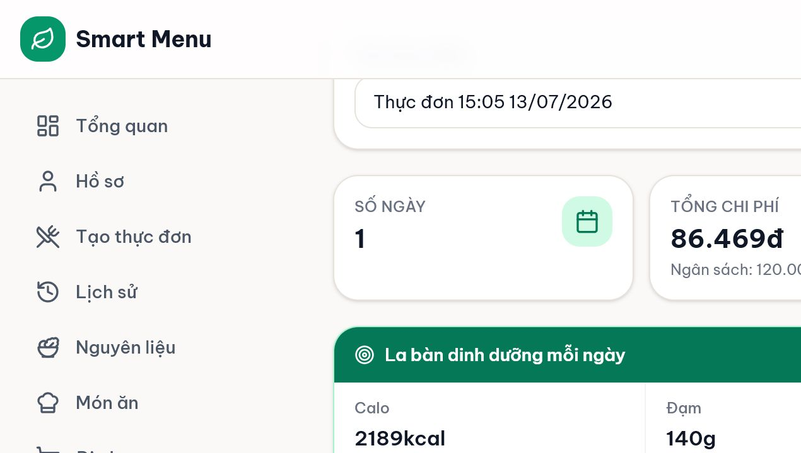
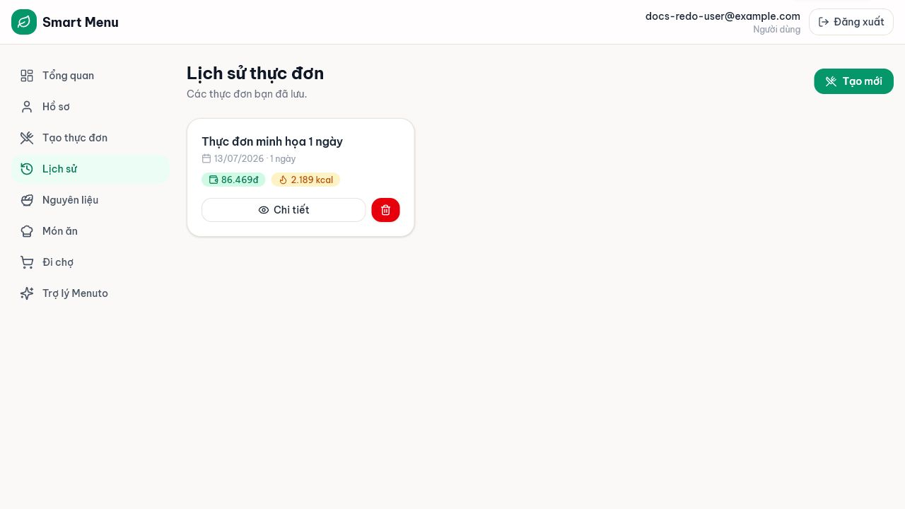

# 03 — Tạo và quản lý thực đơn

## Mục tiêu

Tạo thực đơn từ form hoặc mô tả tiếng Việt, đọc kết quả, tạo lại, phân tích, đổi món, lưu và xem lịch sử.

## Vai trò phù hợp

**User** có hồ sơ dinh dưỡng.

## Điều kiện trước khi bắt đầu

- Hồ sơ có giới tính, tuổi, chiều cao, cân nặng; nên đặt ngân sách/ngày và nguyên liệu loại trừ.
- Dữ liệu có đủ món sáng/tinh bột/mặn/rau hoặc canh planner-ready.
- AI là tùy chọn; form cấu trúc vẫn dùng được khi AI tắt.

## Các bước thực hiện

1. Mở **Tạo thực đơn**. Có thể nhập mô tả như “3 ngày, 3 bữa, ngân sách 360 nghìn, ưu tiên giàu đạm”, rồi chọn **Phân tích yêu cầu**. Kiểm tra lại form vì AI chỉ chuyển câu chữ thành trường dữ liệu.
2. Chọn **Số ngày** từ 1–7 và **Số bữa/ngày**: 2 bữa là trưa+tối; 3 bữa thêm bữa sáng. Nhập **ngân sách tổng** cho toàn bộ số ngày hoặc để trống để dùng ngân sách/ngày trong hồ sơ nhân số ngày.
3. Chọn tag ưu tiên từ danh mục có sẵn, rồi nhấn **Sinh thực đơn**.
4. Nếu hệ thống báo **Không thể tạo thực đơn**, đọc lý do. Với ngân sách dưới mức tối thiểu, tăng ngân sách hoặc giảm số ngày. Nếu thiếu candidate, chỉ xem lại các mục **không thích** không còn cần thiết hoặc nhờ Admin bổ sung dữ liệu; không bỏ dị ứng thật. Tag là ưu tiên mềm nên bớt tag không chữa lỗi thiếu loại món/budget. Không xem `infeasible` là lỗi máy chủ.
5. Ở **Kết quả thực đơn**, kiểm tra tổng chi phí, ngân sách, calo/macro, cảnh báo và cấu trúc: sáng 1 món; trưa/tối gồm tinh bột + mặn + rau hoặc canh.
6. Chọn **Tạo lại** để yêu cầu một signature khác. Chọn **Phân tích thực đơn** để AI diễn giải đúng số liệu đã kiểm tra.
7. Chọn nút **Đổi** cạnh một món, mô tả mong muốn rồi **Tìm món thay thế**. Chỉ các phương án giữ được toàn bộ ràng buộc mới xuất hiện; chọn một phương án để áp dụng vào kết quả đang xem.
8. Đặt **Tên thực đơn**, chọn **Lưu thực đơn**. Mở **Lịch sử** để xem chi tiết hoặc xóa; xóa là không thể hoàn tác.

## Kết quả nhìn thấy

- Plan hợp lệ có trạng thái số liệu rõ, tổng chi phí không vượt ngân sách.
- Tạo lại cho phương án khác nếu dữ liệu có đủ lựa chọn.
- Phân tích AI gồm tóm tắt, ngân sách, dinh dưỡng, điểm phù hợp/cần lưu ý/gợi ý.
- Thực đơn đã lưu xuất hiện trong Lịch sử và được dùng để tạo shopping list.

## Ảnh minh họa có chú thích

Chú thích đọc ảnh: (1) mô tả tiếng Việt; (2) số ngày/số bữa; (3) ngân sách tổng; (4) tag ưu tiên; (5) nút Sinh thực đơn.

Chú thích đọc ảnh: (1) Tạo lại/Lưu/Phân tích; (2) tổng chi phí và calo; (3) la bàn dinh dưỡng; (4) cảnh báo minh bạch; (5) nút đổi từng món.

Chú thích đọc ảnh: (1) tên/ngày; (2) chi phí/calo; (3) Chi tiết; (4) nút xóa có xác nhận.

## Lỗi thường gặp và trạng thái lỗi

- **Hồ sơ chưa đủ:** mở Hồ sơ, bổ sung bốn thông tin cơ thể và lưu.
- **BUDGET_BELOW_MINIMUM:** ngân sách tổng thấp hơn chi phí ghép đủ bữa bắt buộc.
- **Thiếu loại món:** planner không có món sáng/tinh bột/mặn/rau-canh hợp lệ sau khi lọc.
- **Solver hết thời gian nhưng đã có nghiệm:** plan vẫn qua ràng buộc cứng; cảnh báo chỉ nói quá trình tối ưu chưa chứng minh tối ưu tuyệt đối.
- **AI không khả dụng:** bỏ bước parse/phân tích/đổi bằng AI; tạo và lưu plan bằng form vẫn hoạt động.

## Lưu ý an toàn

- Không bỏ nguyên liệu dị ứng chỉ để làm request khả thi; hãy điều chỉnh ngân sách, số ngày hoặc dữ liệu candidate. Tag là ưu tiên mềm, không phải cách chữa hard-infeasible.
- Kiểm tra lại đơn vị ngân sách: đây là **tổng cho toàn bộ số ngày**.
- AI chỉ phân tích/giải thích/xếp hạng; hệ thống tính chi phí, dinh dưỡng, lọc dị ứng, kiểm tra ngân sách và xác nhận plan hợp lệ.

## Kiểm tra mức độ hiểu

### Câu 1 (trắc nghiệm)

Ô ngân sách ở trang Tạo thực đơn là gì?

A. Ngân sách mỗi bữa  
B. Ngân sách tổng cho số ngày đã chọn  
C. Giá tối đa của một món

### Câu 2 (trắc nghiệm)

Bữa trưa/tối hợp lệ gồm cấu trúc nào?

A. Ba món bất kỳ  
B. Tinh bột + món mặn + rau hoặc canh  
C. Một món sáng

### Câu 3 (trắc nghiệm)

Ai quyết định phương án đổi món có hợp lệ?

A. AI tự quyết  
B. Constraint Checker của hệ thống kiểm tra lại toàn plan  
C. Trình duyệt chỉ kiểm tra tên món

### Câu 4 (tình huống)

Request 7 ngày bị báo ngân sách dưới mức tối thiểu. Hãy nêu ba cách xử lý hợp lý mà không bỏ dị ứng.

### Câu 5 (tình huống)

AI đang tắt trước buổi demo. Hãy mô tả cách vẫn tạo, lưu và trình bày một thực đơn hợp lệ.

## Đáp án, giải thích và kết quả

1. **B.** Nếu để trống, backend mới suy ra từ ngân sách/ngày trong hồ sơ.
2. **B.** Đây là cấu trúc cứng của mỗi bữa chính.
3. **B.** AI chỉ đề xuất/xếp hạng; hệ thống kiểm tra lại.
4. Tăng ngân sách tổng; giảm số ngày; xem lại exclusion loại “không thích” nếu thực sự không còn cần hoặc nhờ Admin bổ sung candidate rẻ/đúng loại. Không xóa dị ứng thật; giảm tag không chữa hard-infeasible.
5. Bỏ mô tả tiếng Việt → chọn số ngày/bữa/ngân sách/tag trực tiếp → **Sinh thực đơn** → đọc số liệu/cảnh báo → đặt tên và **Lưu thực đơn** → mở Lịch sử; nói rõ phần AI là lớp tùy chọn.

Tự chấm mỗi câu đúng/hoàn thành là 1 điểm: **5/5 = hiểu tốt; 4/5 = đạt; 3/5 = xem lại; 0–2/5 = đọc lại và thực hành lại.**
