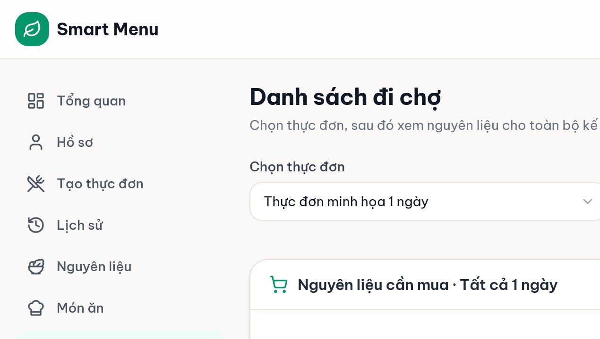
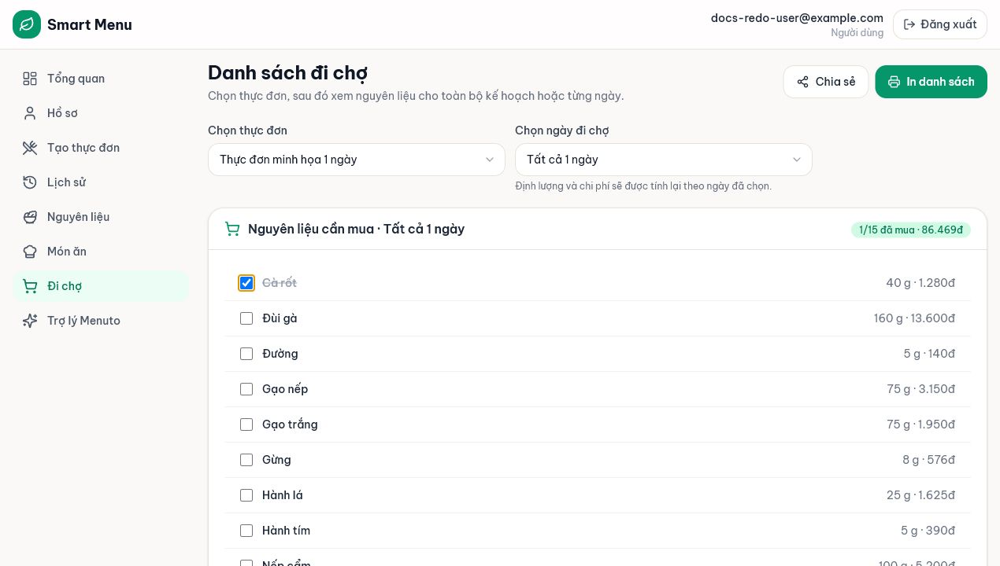
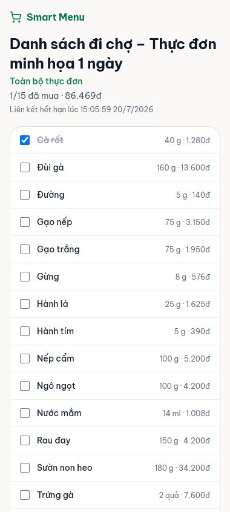

# 04 — Danh sách đi chợ và chia sẻ công khai

## Mục tiêu

Gom nguyên liệu từ thực đơn đã lưu, theo dõi món đã mua, in danh sách và chia sẻ toàn kế hoạch hoặc một ngày qua link công khai.

## Vai trò phù hợp

**User** tạo link. **Người nhận link** không cần đăng nhập nhưng có thể thay đổi trạng thái đã mua.

## Điều kiện trước khi bắt đầu

- User đã lưu ít nhất một thực đơn.
- Thực đơn được tạo bằng Planner V3 và có ledger tồn kho; plan thiếu ledger không còn được hỗ trợ.

## Các bước thực hiện

1. Mở **Đi chợ** và chọn một thực đơn đã lưu.
2. Chọn **Tồn theo ngày** để xem tồn đầu, mua, sử dụng, hết hạn và tồn cuối; hoặc **Cần mua** để xem hàng cần mua. Có thể lọc theo ngày.
3. Ở toàn kỳ, giao diện gộp các lần mua cùng nguyên liệu và đơn vị thành một dòng; tích dòng này cập nhật nguyên tử mọi lần mua nguồn. Ở từng ngày, mỗi lần mua vẫn có trạng thái riêng.
4. Chọn **In danh sách** để in riêng phần hàng cần mua; bản in không chứa bảng ledger/carryover.
5. Chọn **Chia sẻ**. Kiểm tra câu mô tả phạm vi, thời điểm hết hạn và lưu ý quyền của người có link; chọn **Sao chép link**.
6. Gửi link bằng kênh phù hợp. Người nhận mở public page, xem phạm vi và có thể tích/bỏ tích nguyên liệu; thay đổi này dùng chung với danh sách của chủ sở hữu.
7. Khi không cần nữa, mở lại **Chia sẻ** và chọn **Thu hồi**. Thu hồi vô hiệu hóa mọi link shopping list hiện hành của thực đơn đó.

## Kết quả nhìn thấy

- Danh sách có tên, định lượng, đơn vị, chi phí từng nguyên liệu và tổng ước tính.
- Public page không cần đăng nhập, hiển thị thời điểm hết hạn.
- Link hết hạn sau 7 ngày; link hết hạn/thu hồi trả thông báo không còn hợp lệ.

## Ảnh minh họa có chú thích

Chú thích đọc ảnh: (1) chọn thực đơn; (2) chọn toàn bộ/từng ngày; (3) tổng chi phí; (4) Chia sẻ/In; (5) danh sách checkbox.

Chú thích đọc ảnh: (1) bộ đếm tăng; (2) dòng đã mua bị gạch; (3) trạng thái được lưu phía hệ thống.

Chú thích đọc ảnh: (1) tên thực đơn/phạm vi; (2) số đã mua; (3) thời điểm hết hạn; (4) checkbox công khai có thể chỉnh sửa.

## Lỗi thường gặp và trạng thái lỗi

- **Chưa có thực đơn đã lưu:** quay lại Tạo thực đơn, sinh và lưu trước.
- **Danh sách rỗng:** plan không có snapshot nguyên liệu phù hợp hoặc ngày chọn không tồn tại; đọc cảnh báo.
- **Không sao chép tự động:** chọn toàn bộ text link và sao chép thủ công.
- **Link hết hạn/thu hồi:** chủ sở hữu phải tạo link mới; không thể khôi phục token cũ.
- **Chọn ngày nhưng backend trả phạm vi khác:** giao diện báo dữ liệu cũ/xung đột; tải lại ứng dụng trước khi chia sẻ.

## Lưu ý an toàn

- Link là một “chìa khóa”: bất kỳ ai có link đều xem và tích đã mua. Không đăng link công khai ngoài nhóm cần dùng.
- Không chụp màn hình ô link hoặc đưa token vào slide/tài liệu.
- Link theo ngày cưỡng chế write scope: cả PATCH một item và bulk PATCH đều kiểm mọi ID thuộc danh sách nhìn thấy trong token. Dù vậy token vẫn là quyền ghi checkbox; thu hồi ngay nếu bị lộ.
- AI không tham gia gộp danh sách; hệ thống tính chi phí, dinh dưỡng, dị ứng, ngân sách và tính hợp lệ.

## Kiểm tra mức độ hiểu

### Câu 1 (trắc nghiệm)

Link shopping list hiện tại có thời hạn bao lâu?

A. 24 giờ  
B. 7 ngày  
C. Không hết hạn

### Câu 2 (trắc nghiệm)

Người có link công khai làm được gì?

A. Chỉ xem  
B. Xem và thay đổi trạng thái đã mua  
C. Sửa công thức món

### Câu 3 (trắc nghiệm)

Thu hồi link của một thực đơn có ý nghĩa gì?

A. Xóa thực đơn  
B. Vô hiệu hóa mọi link shopping list hiện hành của thực đơn  
C. Chỉ đóng hộp thoại

### Câu 4 (tình huống)

Gia đình chỉ đi chợ cho ngày 2. Hãy mô tả cách tạo đúng link và cách người nhận kiểm chứng phạm vi.

### Câu 5 (tình huống)

Bạn đã gửi nhầm link vào nhóm công khai. Hãy nêu hành động cần làm ngay và cách tạo lại an toàn.

## Đáp án, giải thích và kết quả

1. **B.** Hộp thoại và public page đều hiển thị hạn 7 ngày.
2. **B.** Checkbox là trạng thái dùng chung, không phải trang chỉ đọc.
3. **B.** Thực đơn vẫn còn; token chia sẻ bị vô hiệu hóa.
4. Chọn thực đơn → chọn **Ngày 2** → **Chia sẻ** → kiểm tra hộp thoại ghi Ngày 2 → người nhận mở link và xác nhận tiêu đề/phạm vi Ngày 2.
5. Mở Đi chợ → chọn đúng thực đơn → **Chia sẻ** → **Thu hồi** ngay → tạo link mới → chỉ gửi qua kênh riêng cho người cần dùng.

Tự chấm mỗi câu đúng/hoàn thành là 1 điểm: **5/5 = hiểu tốt; 4/5 = đạt; 3/5 = xem lại; 0–2/5 = đọc lại và thực hành lại.**
