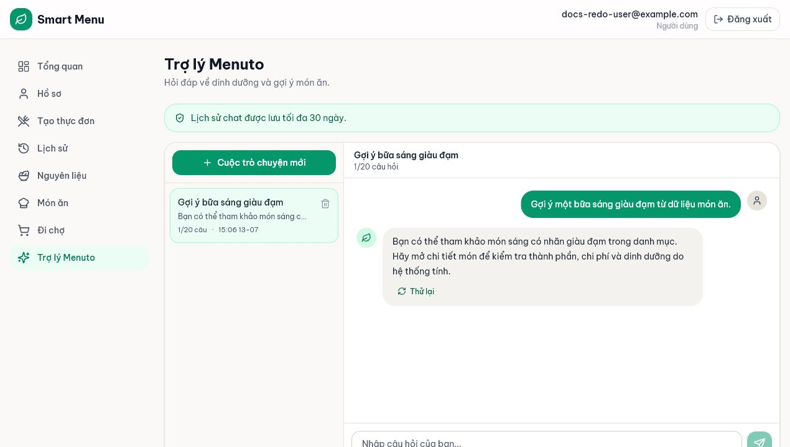
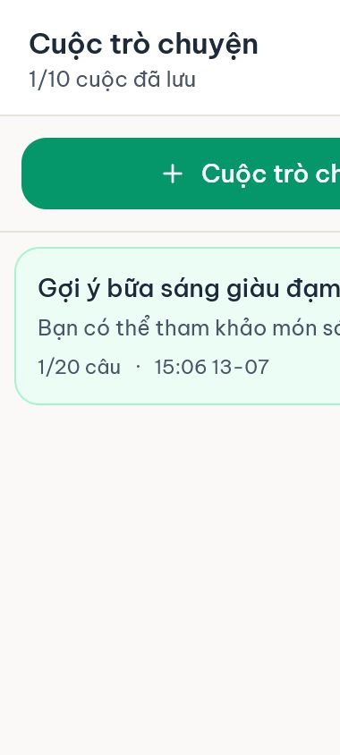

# 05 — Trợ lý Menuto và lịch sử hội thoại

## Mục tiêu

Đặt câu hỏi cho Menuto, mở lịch sử trên desktop/mobile, tạo cuộc mới, retry câu gần nhất và xóa hội thoại.

## Vai trò phù hợp

**User.** Lịch sử thuộc riêng từng tài khoản.

## Điều kiện trước khi bắt đầu

- Đã đăng nhập.
- Quản trị hệ thống đã kích hoạt một AI provider đã test thành công. Nếu AI tắt, lịch sử cũ vẫn xem được nhưng ô gửi bị khóa.

## Các bước thực hiện

1. Mở **Trợ lý Menuto**. Kiểm tra banner: AI đang hoạt động hay chưa được kích hoạt.
2. Chọn một câu gợi ý hoặc nhập câu hỏi về dinh dưỡng, cách nấu/gợi ý món rồi nhấn **Gửi**. Câu hỏi dài tối đa 4.000 ký tự.
3. Chờ câu trả lời stream xuất hiện. Một lượt gồm câu của User và câu trả lời của Menuto; cuộc hội thoại tự lưu.
4. Trên desktop, chọn cuộc ở cột trái. Trên mobile, chọn nút **Mở danh sách cuộc trò chuyện**, rồi chọn một mục trong ngăn kéo.
5. Chọn **Cuộc trò chuyện mới** khi muốn tách chủ đề. Mỗi User lưu tối đa 10 cuộc, mỗi cuộc tối đa 20 câu; đạt giới hạn phải xóa/tạo cuộc khác.
6. Chọn **Thử lại** để tạo lại câu trả lời cho câu gần nhất. Chỉ lượt gần nhất được retry. Nếu lượt gần nhất lỗi, retry nó trước khi hỏi tiếp trong cùng cuộc.
7. Dùng nút xóa cạnh tiêu đề cuộc và xác nhận. Hội thoại không hoạt động quá 30 ngày cũng được backend tự dọn.

## Kết quả nhìn thấy

- Danh sách hiển thị tiêu đề, preview câu gần nhất, số câu và thời gian cập nhật.
- Một cuộc mở đúng thứ tự câu hỏi/câu trả lời.
- AI tắt không làm mất khả năng đọc lịch sử đã lưu.

## Ảnh minh họa có chú thích

Chú thích đọc ảnh: (1) trạng thái retention; (2) cột hội thoại; (3) số câu 1/20; (4) nội dung; (5) ô nhập và nút Thử lại.

Chú thích đọc ảnh: (1) nút mở lịch sử; (2) ngăn kéo 1/10 cuộc; (3) preview; (4) nút xóa; (5) nút đóng có focus.

Giới hạn đang quan sát ở viewport 390 px: một số nhãn dài trong ngăn lịch sử có thể bị cắt ở mép phải. Luồng mở/chọn cuộc vẫn hoạt động, nhưng đây chưa phải trạng thái responsive hoàn thiện.

## Lỗi thường gặp và trạng thái lỗi

- **AI chưa được kích hoạt:** ô nhập bị khóa; liên hệ Super Admin hoặc chỉ đọc lịch sử.
- **Đã đủ 10 cuộc:** xóa một cuộc trước khi tạo mới.
- **Đã đủ 20 câu:** bắt đầu cuộc khác.
- **Menuto đang trả lời:** không gửi tiếp/retry đồng thời; chờ lượt hiện tại kết thúc.
- **Lượt gần nhất failed:** chọn Retry câu hỏi; câu trả lời cũ (nếu có) được giữ khi retry lỗi.
- **Cuộc biến mất sau thời gian dài:** hội thoại không hoạt động quá 30 ngày được dọn theo chính sách hiện tại.
- **Nhãn bị cắt trên màn hình hẹp:** vẫn có thể chọn cuộc; nếu khó đọc, xoay ngang hoặc dùng desktop. Đây là giới hạn giao diện hiện tại, không phải lỗi mất dữ liệu.

## Lưu ý an toàn

- Không gửi mật khẩu, token, API key, thông tin bệnh án hoặc dữ liệu cá nhân không cần thiết vào chat.
- Câu trả lời chỉ là hỗ trợ thông tin, không thay thế chuyên gia y tế.
- Menuto giải thích/gợi ý; hệ thống mới tính chi phí, dinh dưỡng, lọc dị ứng, ngân sách và xác nhận plan hợp lệ.

## Kiểm tra mức độ hiểu

### Câu 1 (trắc nghiệm)

Mỗi User lưu tối đa bao nhiêu cuộc và bao nhiêu câu mỗi cuộc?

A. 10 cuộc × 20 câu  
B. 20 cuộc × 10 câu  
C. Không giới hạn

### Câu 2 (trắc nghiệm)

Khi AI bị tắt, điều gì vẫn dùng được?

A. Gửi câu mới  
B. Xem lịch sử đã lưu  
C. Test provider

### Câu 3 (trắc nghiệm)

Có thể retry lượt nào?

A. Bất kỳ lượt nào  
B. Chỉ câu gần nhất  
C. Chỉ câu đầu tiên

### Câu 4 (tình huống)

Bạn đang ở mobile và muốn mở cuộc “Bữa sáng giàu đạm”. Hãy mô tả thao tác và dấu hiệu đã mở đúng cuộc.

### Câu 5 (tình huống)

Cuộc hiện tại có lượt gần nhất failed và ô nhập không cho hỏi tiếp. Hãy nêu cách xử lý đúng.

## Đáp án, giải thích và kết quả

1. **A.** Giới hạn nằm ở cả frontend và backend.
2. **B.** Composer bị khóa nhưng lịch sử đã lưu vẫn đọc được.
3. **B.** Backend chỉ cho retry lượt mới nhất để giữ thứ tự nhất quán.
4. Chọn **Mở danh sách cuộc trò chuyện** → chọn “Bữa sáng giàu đạm” → ngăn đóng → tiêu đề và nội dung/số câu của cuộc đó xuất hiện.
5. Chọn **Retry câu hỏi** ở lượt failed → chờ hoàn tất → chỉ gửi câu mới sau khi lượt chuyển sang completed; nếu provider vẫn lỗi, báo Super Admin.

Tự chấm mỗi câu đúng/hoàn thành là 1 điểm: **5/5 = hiểu tốt; 4/5 = đạt; 3/5 = xem lại; 0–2/5 = đọc lại và thực hành lại.**
