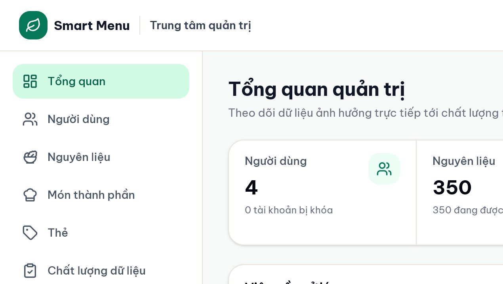
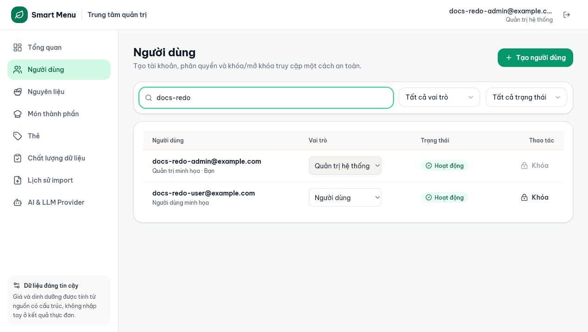

# 06 — Tổng quan quản trị và người dùng

## Mục tiêu

Đọc dashboard quản trị, hiểu bốn vai trò và quản lý tài khoản mà không tự khóa hoặc tự hạ quyền.

## Vai trò phù hợp

- **Biên tập dữ liệu (`data_editor`):** xem dashboard, quản nguyên liệu/món/tag/Quality/import; không thấy trang Người dùng và AI.
- **Quản trị hệ thống (`super_admin`)** và role cũ `admin`: có toàn quyền trên trang Người dùng và AI.

## Điều kiện trước khi bắt đầu

- Đã đăng nhập một tài khoản quản trị đúng role.
- Tài khoản demo không chứa email hoặc tên người thật nếu dùng để chụp/báo cáo.

## Các bước thực hiện

1. Mở **Tổng quan quản trị**. Đọc tổng User/khóa, nguyên liệu, món thành phần và món planner-ready theo từng loại.
2. Xem **Việc cần xử lý**: thiếu giá, thiếu dinh dưỡng, thiếu quy đổi, món thiếu dữ liệu và trùng tên. Chọn một thẻ để mở Quality với bộ lọc tương ứng.
3. Nếu là Super Admin, mở **Người dùng**. Tìm theo email/họ tên hoặc lọc vai trò/trạng thái.
4. Chọn **Tạo người dùng**, nhập email, họ tên, mật khẩu tối thiểu 8 ký tự và role: Người dùng, Biên tập dữ liệu hoặc Quản trị hệ thống.
5. Ở bảng, đổi role của một tài khoản khác hoặc chọn **Khóa/Mở khóa**. Tài khoản hiện tại không thể tự đổi role hay tự khóa từ giao diện.
6. Sau khi đổi role, yêu cầu người đó đăng nhập lại để giao diện và quyền API phản ánh trạng thái mới.

## Kết quả nhìn thấy

- Dashboard nêu rõ số món thật sự sẵn sàng cho planner, không chỉ tổng món.
- User bị khóa không đăng nhập hoặc dùng token cũ để truy cập được.
- Data Editor chỉ thấy menu dữ liệu; Super Admin thấy thêm Người dùng và AI.

## Ảnh minh họa có chú thích

Chú thích đọc ảnh: (1) số liệu chính; (2) món planner-ready theo vai trò; (3) Việc cần xử lý; (4) import gần nhất.

Chú thích đọc ảnh: (1) tìm/lọc; (2) role; (3) trạng thái; (4) khóa/mở khóa; (5) dòng “Bạn” bị vô hiệu hóa thao tác nguy hiểm.

## Lỗi thường gặp và trạng thái lỗi

- **Không thấy Người dùng/AI:** tài khoản là Data Editor; đây là đúng phân quyền.
- **Nút role/Khóa bị vô hiệu ở dòng của mình:** hệ thống chặn tự khóa/tự thay quyền.
- **403 Không đủ quyền:** token hiện tại không có role cần thiết; đăng nhập lại sau khi quyền được cấp.
- **Email đã tồn tại:** tìm tài khoản cũ thay vì tạo trùng.
- **Số Quality bằng 0:** không phải lỗi; dataset đang sạch theo kiểm tra hiện tại.

## Lưu ý an toàn

- Áp dụng nguyên tắc ít quyền nhất: chỉ cấp Super Admin cho người quản hệ thống.
- Không chiếu danh sách email người dùng thật trong slide hoặc screenshot.
- AI chỉ phân tích/giải thích; dashboard/planner dùng hệ thống để tính chi phí, dinh dưỡng, dị ứng, ngân sách và tính hợp lệ.

## Kiểm tra mức độ hiểu

### Câu 1 (trắc nghiệm)

Role nào quản dữ liệu thực phẩm nhưng không quản tài khoản/AI?

A. User  
B. Data Editor  
C. Super Admin

### Câu 2 (trắc nghiệm)

Chỉ số nào phản ánh đúng số món có thể vào planner?

A. Tổng món thành phần  
B. Món sẵn sàng cho planner  
C. Tổng User

### Câu 3 (trắc nghiệm)

Vì sao Admin không tự khóa tài khoản đang đăng nhập?

A. Do lỗi trình duyệt  
B. Là rào chắn tránh tự mất quyền truy cập  
C. Vì tài khoản không có email

### Câu 4 (tình huống)

Một thành viên chỉ cần sửa giá, công thức và import dữ liệu. Bạn sẽ cấp role nào và kiểm chứng ra sao?

### Câu 5 (tình huống)

Bạn chuẩn bị ảnh trang Người dùng cho slide nhưng bảng có email thật. Hãy nêu quy trình an toàn.

## Đáp án, giải thích và kết quả

1. **B.** Data Editor có quyền dữ liệu nhưng không có quyền hệ thống nhạy cảm.
2. **B.** Tổng món có thể gồm món ẩn/thiếu dữ liệu; planner-ready đã qua cổng chất lượng.
3. **B.** Giao diện và backend bảo vệ tài khoản hiện tại khỏi thao tác tự khóa/hạ quyền.
4. Cấp **Biên tập dữ liệu** → yêu cầu đăng nhập lại → xác nhận thấy Ingredients/Dishes/Tags/Quality/Imports nhưng không thấy Users/AI → thử API/UI đúng phạm vi.
5. Dùng tài khoản demo → lọc tìm chỉ các email demo → kiểm tra ảnh trước khi lưu → không chụp password/token → xóa tài khoản demo sau khi hoàn thành nếu không còn dùng.

Tự chấm mỗi câu đúng/hoàn thành là 1 điểm: **5/5 = hiểu tốt; 4/5 = đạt; 3/5 = xem lại; 0–2/5 = đọc lại và thực hành lại.**

