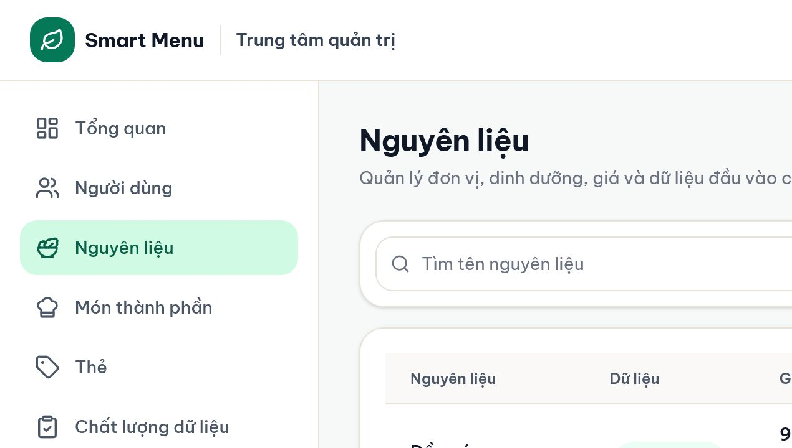
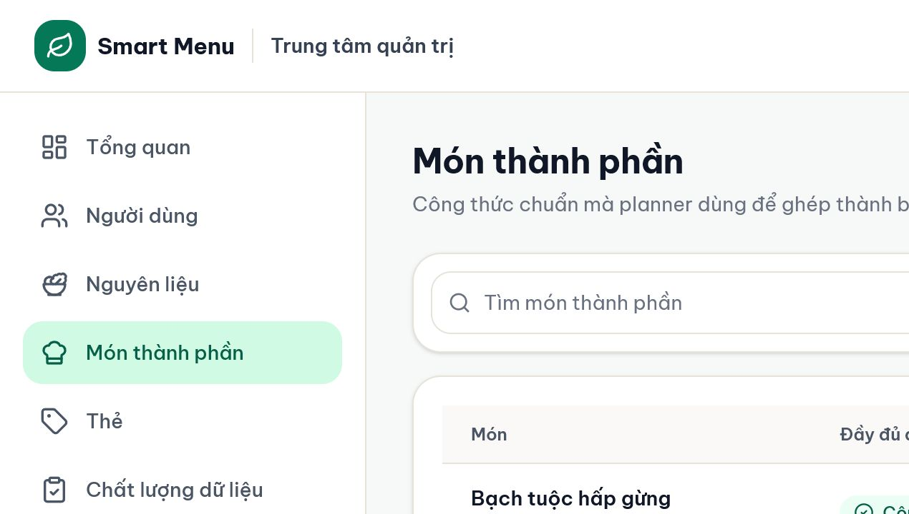
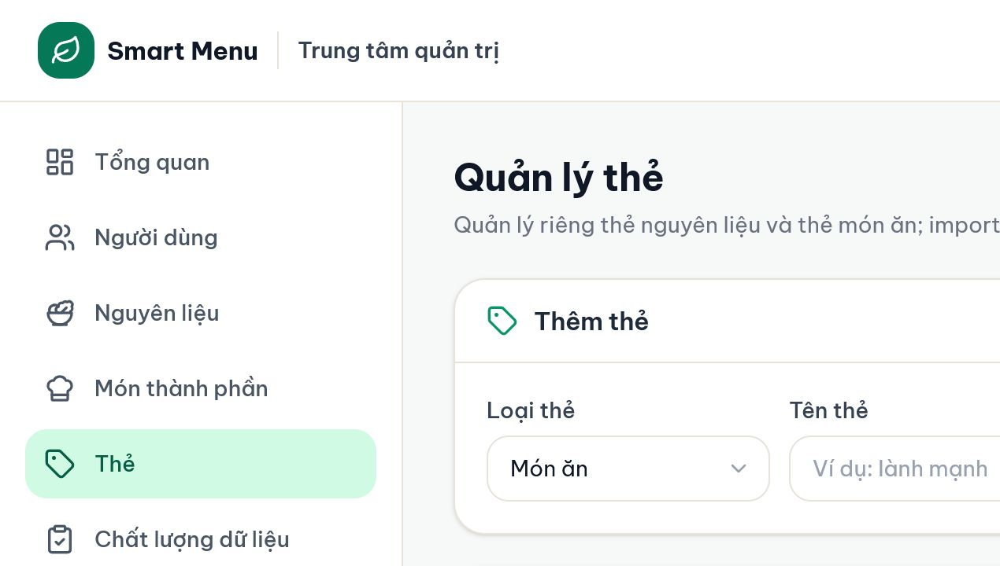

# 07 — Quản trị nguyên liệu, món thành phần và thẻ

## Mục tiêu

Quản lý dữ liệu chuẩn mà planner dùng: đơn vị/quy đổi/dinh dưỡng/giá của nguyên liệu; công thức/loại của món; và hai danh mục thẻ riêng.

## Vai trò phù hợp

**Biên tập dữ liệu** hoặc **Quản trị hệ thống**.

## Điều kiện trước khi bắt đầu

- Hiểu nguồn dữ liệu và đơn vị trước khi sửa.
- Có bằng chứng cho giá/dinh dưỡng; không điền số đoán chỉ để làm badge xanh.

## Các bước thực hiện

1. Mở **Nguyên liệu** trong khu quản trị. Dùng tìm kiếm và bộ lọc nhóm, trạng thái, chất lượng; **Export dữ liệu** nếu cần bản đối soát.
2. Chọn **Thêm nguyên liệu** hoặc nút sửa. Nhập tên, nhóm, đơn vị mặc định và **gram/đơn vị**; thêm dinh dưỡng trên 100g khi có nguồn.
3. Ở **Thêm mốc giá**, nhập giá gốc, đơn vị giá, giá quy đổi theo đơn vị mặc định và nguồn. Mốc giá mới được thêm vào lịch sử, không ghi đè lịch sử cũ.
4. Dùng **Ẩn** để ngừng dùng dữ liệu mới mà vẫn giữ tham chiếu lịch sử. Chỉ **Xóa vĩnh viễn** khi chắc chắn bản ghi không cần bảo toàn và hệ thống cho phép.
5. Mở **Món thành phần**. Tạo/sửa tên, loại món, cách chế biến, thẻ, mô tả, hướng dẫn và công thức. Thêm nguyên liệu, định lượng > 0 và đơn vị cho từng dòng; giá/macro món được tính tự động.
6. Chỉ kích hoạt món khi công thức phù hợp loại: món sáng; tinh bột; món mặn; rau/món phụ; canh. Món thiếu công thức/giá/dinh dưỡng không vào planner-ready.
7. Mở **Thẻ**. Chọn loại **Món ăn** hoặc **Nguyên liệu**, nhập tên rồi thêm. Có thể đổi tên hoặc ngừng dùng; import sẽ tự bổ sung tag mới đúng loại.

## Kết quả nhìn thấy

- Nguyên liệu đủ dữ liệu có badge dinh dưỡng và giá quy đổi rõ.
- Món đủ dữ liệu hiển thị tổng calo, đạm, carb và chi phí; số planner-ready tăng khi mọi điều kiện đạt.
- Cùng tên tag có thể tồn tại ở hai loại khác nhau nhưng không trùng trong cùng loại.

## Ảnh minh họa có chú thích

Chú thích đọc ảnh: (1) tìm/lọc chất lượng; (2) Export/Thêm; (3) trạng thái dinh dưỡng; (4) giá gốc và giá quy đổi; (5) sửa/ẩn.

Chú thích đọc ảnh: (1) loại/chất lượng; (2) công thức; (3) tổng dinh dưỡng/chi phí; (4) sửa/ẩn; (5) planner dùng các vai trò món.

Chú thích đọc ảnh: (1) chọn loại thẻ; (2) thêm; (3) thẻ món dùng cho ưu tiên planner; (4) thẻ nguyên liệu dùng phân loại/import; (5) đổi tên/ngừng dùng.

## Lỗi thường gặp và trạng thái lỗi

- **Cần quy đổi:** đơn vị không phải gram nhưng hệ số gram/đơn vị chưa đáng tin.
- **Thiếu giá chuẩn hóa:** có giá gốc nhưng thiếu giá theo đơn vị mặc định; planner không tính đúng món.
- **Món thiếu công thức:** chưa có nguyên liệu hoặc định lượng/đơn vị không hợp lệ.
- **Món đã active nhưng không planner-ready:** một nguyên liệu bị ẩn hoặc thiếu nutrition/price.
- **Thẻ đã tồn tại:** kiểm tra đúng loại; không tạo trùng tên không phân biệt hoa/thường trong cùng loại.
- **Xóa thất bại:** bản ghi đang được tham chiếu; ưu tiên Ẩn và xử lý quan hệ trước.

## Lưu ý an toàn

- Sửa dữ liệu canonical ảnh hưởng các lần tạo menu tiếp theo; plan cũ dùng snapshot để giữ ổn định.
- Không biến số 0 thành “thiếu”: Quality phân biệt không có bản ghi với giá trị 0 hợp lệ.
- AI không tạo dữ liệu giá/dinh dưỡng chuẩn; hệ thống dùng công thức và Constraint Checker để kiểm tra dị ứng, ngân sách và plan.

## Kiểm tra mức độ hiểu

### Câu 1 (trắc nghiệm)

“Gram/đơn vị” dùng để làm gì?

A. Đặt tên nguyên liệu  
B. Quy đổi đơn vị công thức về gram để tính dinh dưỡng  
C. Chọn role User

### Câu 2 (trắc nghiệm)

Khi ngừng dùng một nguyên liệu nhưng muốn giữ lịch sử, nên làm gì?

A. Ẩn  
B. Xóa vĩnh viễn ngay  
C. Đổi tên thành “cũ”

### Câu 3 (trắc nghiệm)

Tag “giàu đạm” của món và nguyên liệu có thể cùng tồn tại không?

A. Có, vì khác loại thẻ  
B. Không bao giờ  
C. Chỉ khi AI bật

### Câu 4 (tình huống)

Một món có công thức nhưng vẫn báo thiếu giá. Hãy nêu thứ tự kiểm tra từ món xuống nguyên liệu.

### Câu 5 (tình huống)

Bạn cần thêm dầu bán theo lít nhưng công thức dùng ml. Hãy nêu các trường quan trọng để planner tính đúng.

## Đáp án, giải thích và kết quả

1. **B.** Nutrition facts lưu trên 100g nên cần hệ số quy đổi.
2. **A.** Ẩn ngăn dùng mới nhưng bảo toàn tham chiếu.
3. **A.** Unique được áp dụng theo cặp loại + tên.
4. Mở món → xem từng nguyên liệu có badge thiếu giá → mở nguyên liệu lỗi → kiểm tra có price snapshot, đơn vị giá và `price_per_default_unit` → sửa nguồn/quy đổi → quay lại món/Quality xác nhận.
5. Đơn vị mặc định `ml`; gram/ml phù hợp mật độ; giá gốc theo `l`; giá quy đổi theo `ml`; nguồn và ngày giá; nutrition trên 100g có nguồn.

Tự chấm mỗi câu đúng/hoàn thành là 1 điểm: **5/5 = hiểu tốt; 4/5 = đạt; 3/5 = xem lại; 0–2/5 = đọc lại và thực hành lại.**

