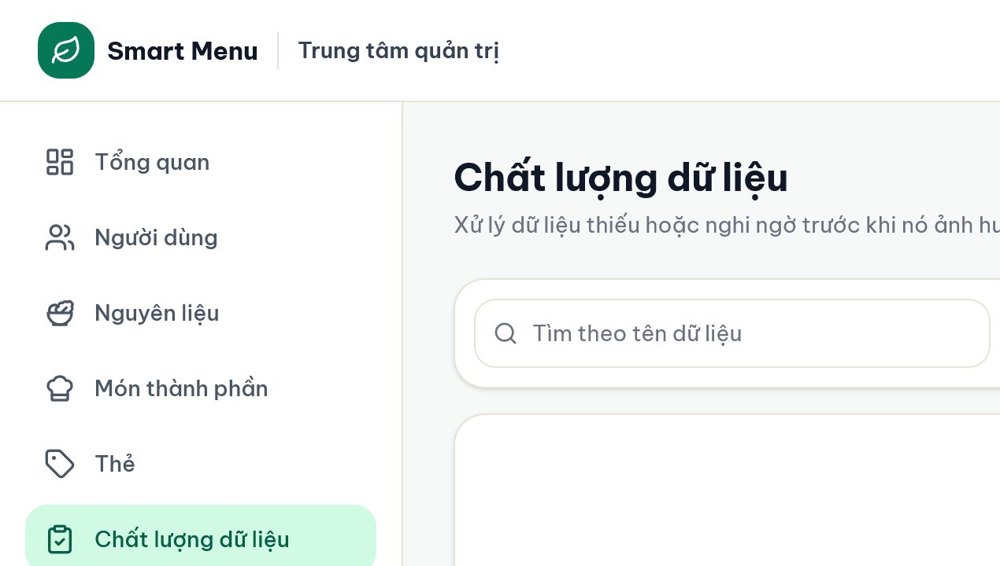
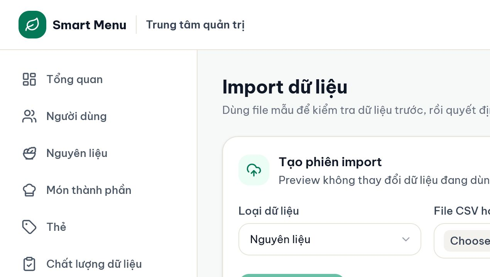

# 08 — Chất lượng dữ liệu và import

## Mục tiêu

Tìm dữ liệu thiếu/nghi ngờ, sửa đúng đối tượng và import CSV/XLSX qua preview cùng quyết định conflict trước khi ghi.

## Vai trò phù hợp

**Biên tập dữ liệu** hoặc **Quản trị hệ thống**.

## Điều kiện trước khi bắt đầu

- Có file theo mẫu Smart Menu; không dùng file chứa dữ liệu cá nhân hoặc secret.
- Khi import món, nguyên liệu được tham chiếu phải đã tồn tại. Nên import nguyên liệu trước, món sau.

## Các bước thực hiện

1. Mở **Chất lượng dữ liệu**. Lọc theo đối tượng Nguyên liệu/Món, mức Lỗi/Cảnh báo hoặc mã: thiếu giá, thiếu dinh dưỡng, cần quy đổi, thiếu công thức, trùng tên.
2. Đọc **Vấn đề**, **Chi tiết** và chọn **Sửa dữ liệu** để đi đúng trang/bộ lọc. Sửa nguồn gốc của lỗi rồi quay lại Quality xác nhận mục biến mất.
3. Mở **Lịch sử import**. Chọn loại dữ liệu **Nguyên liệu** hoặc **Món ăn**; tải mẫu XLSX/CSV để giữ đúng cột.
4. Chọn file rồi **Kiểm tra file**. Preview chỉ đọc file và tạo một phiên kiểm tra, chưa thay đổi dữ liệu đang dùng.
5. Đọc bốn số: tổng dòng, hợp lệ, trùng, lỗi. Sửa mọi lỗi; cảnh báo cần được hiểu trước khi commit.
6. Nếu có conflict, mở hộp quyết định. Chọn riêng những dòng được phép **thay thế**; dòng trùng không chọn sẽ **bỏ qua**; dòng mới hợp lệ vẫn được import.
7. Chọn Import/Commit. Đối chiếu kết quả thêm/cập nhật/bỏ qua và xem phiên trong lịch sử.
8. Kiểm tra lại Dashboard, Quality, Ingredients/Dishes và typed tags sau import. Import tự đưa tag vào đúng loại `ingredient` hoặc `dish`.

## Kết quả nhìn thấy

- Dataset sạch có trạng thái “Không còn vấn đề phù hợp”.
- Phiên preview/commit có filename, loại, trạng thái, số hợp lệ/lỗi và thời gian.
- Commit là giao dịch: nếu dữ liệu thay đổi sau preview hoặc có lỗi trong quá trình ghi, thao tác bị từ chối/rollback thay vì ghi dở dang.

## Ảnh minh họa có chú thích

Chú thích đọc ảnh: (1) tìm kiếm; (2) đối tượng; (3) mức độ; (4) mã vấn đề; (5) giải thích giá trị 0 không tự động là thiếu.

Chú thích đọc ảnh: (1) tải mẫu; (2) chọn loại/file; (3) preview chưa ghi; (4) quyết định conflict; (5) lịch sử trạng thái và số dòng.

## Lỗi thường gặp và trạng thái lỗi

- **Chọn nhầm loại file:** file nguyên liệu kiểm tra theo schema món sẽ có nhiều lỗi; chọn lại đúng loại.
- **Không tìm thấy ingredient_id trong món:** import nguyên liệu trước hoặc sửa ID/code theo dataset hiện tại.
- **File có lỗi:** `can_commit` là false; sửa file và preview lại.
- **Dữ liệu thay đổi sau preview:** hệ thống chặn commit; chạy preview mới để tránh ghi đè mù.
- **Conflict không được chọn:** dòng đó bị bỏ qua, không phải bị xóa.
- **Quality vẫn có lỗi sau commit:** mở vấn đề cụ thể; file có thể hợp lệ về định dạng nhưng thiếu giá/dinh dưỡng cần cho planner.

## Lưu ý an toàn

- Luôn lưu bản backup/export trước import lớn; không commit khi chưa xem conflict.
- File tải lên không được chứa credentials, access token, API key hoặc dữ liệu cá nhân thật.
- AI không quyết định dòng import hợp lệ; hệ thống validate schema, công thức, giá, dinh dưỡng và planner constraints.

## Kiểm tra mức độ hiểu

### Câu 1 (trắc nghiệm)

Preview import có thay đổi dữ liệu đang dùng không?

A. Có, ghi ngay mọi dòng  
B. Không, chỉ đọc/kiểm tra và tạo phiên preview  
C. Chỉ khi AI bật

### Câu 2 (trắc nghiệm)

Một dòng conflict không được chọn “thay thế” sẽ ra sao?

A. Bị bỏ qua  
B. Xóa bản ghi cũ  
C. Luôn tạo bản sao

### Câu 3 (trắc nghiệm)

Thứ tự import khuyến nghị là gì?

A. Món trước, nguyên liệu sau  
B. Nguyên liệu trước, món sau  
C. Thứ tự không liên quan

### Câu 4 (tình huống)

Preview báo 100 dòng hợp lệ, 3 conflict và 2 lỗi. Bạn muốn thay thế 1 conflict. Hãy mô tả quy trình đúng.

### Câu 5 (tình huống)

Commit thành công nhưng Dashboard vẫn báo 5 món chưa planner-ready. Bạn sẽ kiểm chứng và sửa thế nào?

## Đáp án, giải thích và kết quả

1. **B.** Preview được thiết kế để xem trước an toàn.
2. **A.** Chỉ dòng conflict được chọn mới cập nhật bản ghi cũ.
3. **B.** Công thức món tham chiếu nguyên liệu đã có.
4. Sửa 2 lỗi trong file → preview lại → mở conflict → chỉ chọn 1 dòng được phép thay thế → kiểm tra `can_commit` → commit → đối chiếu created/updated/skipped.
5. Mở **Quality** lọc Món → đọc mã thiếu công thức/giá/dinh dưỡng → chọn Sửa dữ liệu → kiểm tra ingredient liên quan → sửa → quay lại Dashboard xác nhận planner-ready tăng và issue giảm.

Tự chấm mỗi câu đúng/hoàn thành là 1 điểm: **5/5 = hiểu tốt; 4/5 = đạt; 3/5 = xem lại; 0–2/5 = đọc lại và thực hành lại.**

