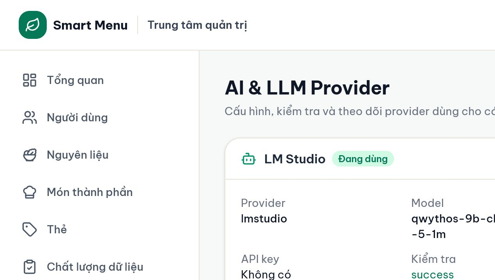

# 09 — AI provider, system prompt và nhật ký

## Mục tiêu

Tạo cấu hình provider ở trạng thái draft, quản lý system prompt toàn cục, kích hoạt/tắt an toàn và đọc nhật ký vận hành 30 ngày.

## Vai trò phù hợp

**Quản trị hệ thống** hoặc role tương thích cũ `admin`. Data Editor không có quyền trang này.

## Điều kiện trước khi bắt đầu

- Có Base URL/model đúng; API key chỉ nhập khi provider yêu cầu.
- Production bật AI phải có khóa mã hóa cấu hình AI trong biến môi trường.
- Không chiếu hoặc sao chép API key vào screenshot, slide hay log trao đổi.

## Các bước thực hiện

1. Mở **AI & LLM Provider**. Đọc provider đang dùng, model, API key đã che, trạng thái test và log gần đây.
2. Chọn **Thêm provider**. Đặt tên, chọn OpenAI, DeepSeek, LM Studio, Google Gemini hoặc Custom OpenAI-compatible; kiểm tra Base URL, Model, Timeout và API key.
3. Lưu thành **draft** hoặc chọn **Test kết nối**. Test không chỉ kiểm tra HTTP mà còn kiểm tra structured output phù hợp với tính năng Smart Menu.
4. Chỉ chọn **Kích hoạt** khi `test_status=success` và phiên bản cấu hình vừa test vẫn là phiên bản hiện tại. Sửa model/Base URL/key làm cấu hình cần test lại.
5. Chọn **Models** trên provider inactive để tải danh sách model (nếu provider hỗ trợ), hoặc **Clone** để tạo draft từ cấu hình hiện tại mà không tắt provider đang dùng.
6. Chọn **Tắt** để vô hiệu AI. User vẫn dùng form planner, lịch sử/menu/shopping list; Menuto không gửi câu mới.
7. Trong **System prompt AI**, chọn riêng Chat, Parse yêu cầu, Giải thích thực đơn hoặc Đổi món. Sửa nội dung rồi chọn **Lưu và áp dụng**; request kế tiếp dùng nội dung mới. Chọn **Khôi phục mặc định** để xóa override và quay về prompt trong code.
8. Trong **Nhật ký AI — lưu 30 ngày**, đọc feature, model, trạng thái và latency. Chỉ mở **Chi tiết** khi cần điều tra và được phép xem nội dung; chọn **Dọn log quá hạn** để xóa log đã hết hạn.

## Kết quả nhìn thấy

- Tối đa một provider active; provider active có nhãn “Đang dùng”.
- Mỗi feature có trạng thái prompt “Mặc định” hoặc “Đã tùy chỉnh”; prompt là cấu hình toàn cục, không gắn với provider.
- API key chỉ trả về dạng che hoặc “Không có”, không hiển thị secret đầy đủ.
- Log vận hành có hạn 30 ngày. Đây là dữ liệu khác với lịch sử Menuto, dù cả hai hiện có retention 30 ngày.

## Ảnh minh họa có chú thích

Chú thích đọc ảnh: (1) provider active; (2) loại/model/API key che; (3) Test/Tắt/Clone; (4) log feature/trạng thái/latency; (5) dọn log quá hạn.

## Lỗi thường gặp và trạng thái lỗi

- **Test failed:** đọc lỗi đã rút gọn; kiểm tra provider đang chạy, Base URL, model, key và timeout.
- **Không có nút Kích hoạt:** provider chưa test thành công hoặc cấu hình đã thay đổi sau test.
- **Models bị vô hiệu:** provider đang active; clone/tắt hoặc dùng draft khác để khám phá model an toàn.
- **Menuto báo AI chưa kích hoạt:** chưa có provider active hoặc cấu hình runtime tắt AI.
- **Parse/giải thích/đổi món trả sai định dạng:** khôi phục prompt mặc định trước, vì ba feature này phụ thuộc structured output.
- **Latency rất cao:** không kết luận app lỗi; so sánh provider, model, timeout và log feature trước khi đổi.
- **Không thấy trang AI:** tài khoản không phải Super Admin.

## Lưu ý an toàn

- Base URL được backend kiểm tra scheme/hostname/credentials và chặn hai metadata hostname cụ thể; đây chưa phải phòng vệ SSRF toàn diện. Không dùng URL không rõ nguồn hoặc coi mọi địa chỉ nội bộ đã được chặn.
- Log chi tiết có thể chứa đầy đủ câu hỏi, context/plan payload và response của User; áp dụng quyền tối thiểu, không đưa lên slide và nhớ rằng xóa conversation không xóa request log.
- Không nhập API key hoặc dữ liệu cá nhân vào system prompt; nội dung prompt có thể xuất hiện trong request log và audit thay đổi.
- AI chỉ parse/giải thích/xếp hạng. Hệ thống vẫn tính chi phí, dinh dưỡng, lọc dị ứng, kiểm tra ngân sách và xác nhận plan hợp lệ.

## Kiểm tra mức độ hiểu

### Câu 1 (trắc nghiệm)

Điều kiện đúng để kích hoạt provider là gì?

A. Chỉ cần có tên  
B. Test thành công và cấu hình chưa đổi sau test  
C. Có ít nhất một log lỗi

### Câu 2 (trắc nghiệm)

Tắt AI ảnh hưởng thế nào đến planner?

A. Planner form vẫn hoạt động; parse/giải thích/Menuto bị hạn chế  
B. Xóa mọi thực đơn  
C. Làm database dừng

### Câu 3 (trắc nghiệm)

AI request log và lịch sử Menuto là gì?

A. Cùng một bảng  
B. Hai dữ liệu riêng, hiện đều có retention 30 ngày  
C. Không có thời hạn

### Câu 4 (tình huống)

Bạn cần đổi model đang chạy mà không làm gián đoạn ngay. Hãy mô tả luồng an toàn.

### Câu 5 (tình huống)

User báo Menuto chậm nhưng planner bình thường. Hãy nêu các bằng chứng cần xem trước khi thay provider.

## Đáp án, giải thích và kết quả

1. **B.** Tested version phải khớp config version hiện tại.
2. **A.** Đây là ranh giới fallback thiết kế sẵn.
3. **B.** Conversation phục vụ sản phẩm; log phục vụ vận hành.
4. **Clone** provider active → sửa model ở draft → Test kết nối/structured output → chỉ khi pass mới Kích hoạt draft; giữ provider cũ cho tới thời điểm chuyển.
5. Xem log đúng feature/thời gian, status, latency, model/provider, error/timeout; test kết nối; kiểm tra provider local/remote; so sánh nhiều request. Không mở/chia sẻ nội dung chi tiết nếu không cần.

Tự chấm mỗi câu đúng/hoàn thành là 1 điểm: **5/5 = hiểu tốt; 4/5 = đạt; 3/5 = xem lại; 0–2/5 = đọc lại và thực hành lại.**
