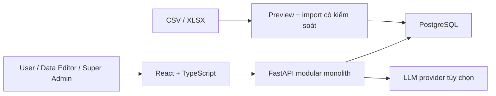
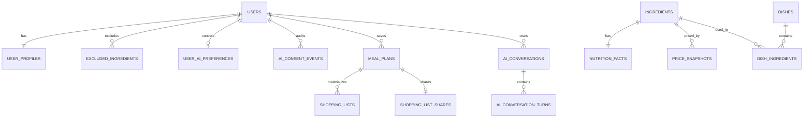
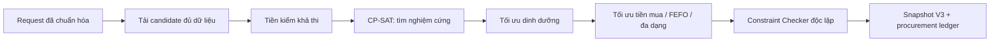

# Tổng quan kỹ thuật Smart Menu

## Kiến trúc

Smart Menu là một **modular monolith**: React/TypeScript ở frontend, FastAPI ở backend và PostgreSQL lưu dữ liệu. Backend chia module theo nghiệp vụ như `identity`, `profiles`, `dishes`, `meal_planning`, `shopping_lists`, `ai`, `tags` và `admin`.

Frontend dùng route guard để tách khu người dùng và khu quản trị. Backend mới là nơi quyết định quyền thật: `user` dùng tính năng cá nhân; `data_editor` quản lý dữ liệu thực phẩm; `admin` cũ được xem như `super_admin`; `super_admin` quản lý tài khoản và AI provider.

## Dữ liệu chính

`v_dish_candidates` chỉ trả món đang hoạt động, có công thức, nguyên liệu đang hoạt động, đủ dữ liệu giá/dinh dưỡng và tổng dương. Đây là nguồn món duy nhất cho planner và danh mục món của User.

Tag được tách thành hai loại: `dish` và `ingredient`. Hai tag có thể trùng tên nếu khác loại. Import tự bổ sung tag vào đúng danh mục.

## Planner CP-SAT

Planner nhận yêu cầu 1–7 ngày, 2 hoặc 3 bữa/ngày, ngân sách tổng, tag ưu tiên và nguyên liệu loại trừ từ hồ sơ.

- 2 bữa/ngày: bữa trưa và bữa tối.
- 3 bữa/ngày: thêm một món sáng.
- Mỗi bữa trưa/tối: 1 món tinh bột + 1 món mặn + 1 món rau hoặc canh.
- Ràng buộc cứng: đủ ngày/bữa, đúng cấu trúc món, không có nguyên liệu loại trừ, dữ liệu đầy đủ và không vượt ngân sách.
- Mục tiêu mềm: gần mục tiêu calo/macro, đa dạng, tag ưu tiên và chi phí thấp hơn trong miền nghiệm hợp lệ.
- Nếu ngân sách thấp hơn mức tối thiểu hoặc thiếu loại món bắt buộc, hệ thống trả kết quả `infeasible` có mã và lý do; không tạo một menu sai để lấp chỗ trống.

Khi “Tạo lại”, signature của thực đơn trước được đưa vào solver để yêu cầu phương án khác. Khi đổi món, AI có thể xếp hạng đề xuất nhưng mỗi phương án phải qua lại toàn bộ Constraint Checker trước khi xuất hiện cho User.

## Ranh giới AI

AI có bốn nhóm tác vụ: parse mô tả tiếng Việt, giải thích thực đơn đã kiểm tra, gợi ý đổi món và hội thoại Menuto. Mọi output có cấu trúc phải qua schema validation. Chat chia thành `general`, `meal_advice` và `health_reference`; mode được cố định theo conversation.

`general` không đọc profile. Hai mode cá nhân hóa chỉ đọc projection đúng User sau consent phiên bản hiện hành; health reference còn yêu cầu tuổi từ 18 và được phép đọc thêm tuổi, giới tính, chiều cao, cân nặng. Backend tách session đọc context và session ghi state, kết hợp role PostgreSQL/RLS để giảm quyền. Health reference ưu tiên native web search có citation hợp lệ; nếu không có, UI ghi rõ model fallback chưa được kiểm chứng web theo thời gian thực.

AI không phải nguồn đúng cho giá, dinh dưỡng hoặc tính hợp lệ. Backend tính lại các số liệu từ snapshot/công thức và quyết định kết quả cuối. Nếu AI tắt, User vẫn tạo thực đơn bằng form có cấu trúc và xem dữ liệu đã lưu.

Lịch sử Menuto tách khỏi log vận hành:

- Tối đa 10 cuộc hội thoại/User và 20 câu/cuộc.
- Chỉ retry câu gần nhất; câu lỗi phải được retry trước khi hỏi tiếp trong cùng cuộc.
- Cuộc hội thoại không hoạt động quá 30 ngày được dọn trước thao tác đọc/ghi và có vòng background. Vòng background hiện còn dùng primary engine; phải đổi sang AI state engine nếu triển khai state ở database vật lý riêng.
- AI request log có thời hạn 30 ngày riêng và không được dùng làm lịch sử hội thoại sản phẩm.

## Chia sẻ và bảo mật

Link danh sách đi chợ chứa token có phạm vi hẹp, hết hạn sau 7 ngày và có thể thu hồi. Link có thể giới hạn ở một ngày cụ thể. Bất kỳ ai có link còn hiệu lực đều xem và thay đổi trạng thái “đã mua”, vì vậy phải coi link như thông tin nhạy cảm. Cập nhật nhóm chỉ thành công khi mọi item đều thuộc đúng scope đã ký; nếu dữ liệu đổi đồng thời, transaction rollback để tránh trạng thái nửa vời.

Mật khẩu được hash; API kiểm tra token, trạng thái tài khoản, ownership và role. Secret, khóa mã hóa cấu hình AI, Google client ID và CORS được cấu hình qua biến môi trường. Google ID token được xác minh phía backend; phiên bản hiện tại chỉ chấp nhận email Gmail đã được Google xác minh.

## Đi sâu vào code

Tài liệu này cố ý giữ ở mức tổng quan. Developer cần sửa hoặc review code nên đọc [Handbook kỹ thuật](code/README.md), [API reference đầy đủ](code/api/README.md) và [ADR](code/adr/README.md) để đối chiếu source, schema và quyết định hiện tại.
